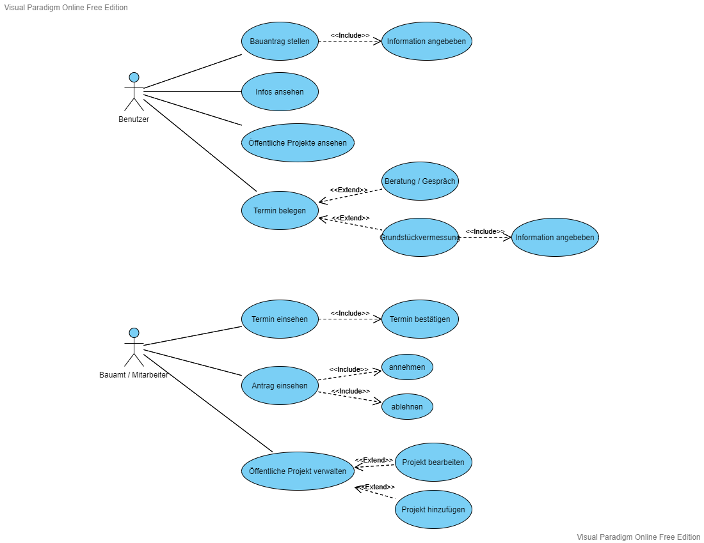
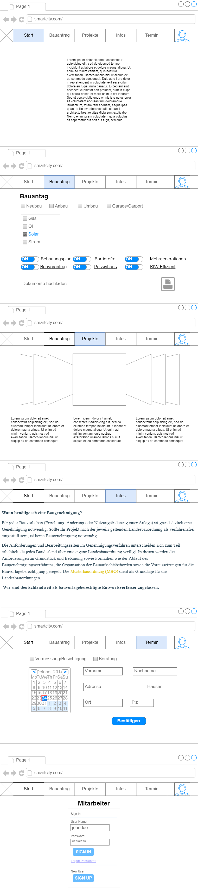

# Bauamt

**Autor:** Marc Leenders

## Überblick

- Der Microservice Bauamt soll einem Benutzter ermöglichen, alle Tätigkeiten eines Bauamtes digital erledigen zu können.
- Konzeptionelles Analyseklassendiagramm (logische Darstellung der Konzepte der Anwendungsdomäne)

## Funktionale Anforderungen

**Akteure**
| **Akteur** | **Definition** |
| :------ | :----- |
| Benutzer | Angemeldeter Benutzer mit grundlegenden Berechtigungen |
| Mitarbeiter | Sachbearbeiter des Bauamts mit zusätzlichen Berechtigungen für die Bearbeitung und Einsicht |

## Anforderungen im Detail

- Strukturierung der User Stories in funktionale Gruppen
- Sicherheit: Misuse-Stories formulieren

**User Stories**
| **Name**| **In meiner Rolle als**...|   ...**möchte ich**...   | ..., **so dass**... | **Erfüllt, wenn**... | **Priorität**   |
|:-----|:----------:|:-------------------|:-------------|:---------|:----------------|
| Authentifizierung |Benutzer| meine Identität bestätigt bekomme | ich Handlungen unter den Benutzer tätigen kann | Die Daten des Benutzers angezeigt werden | Muss |
| Antrag stellen | Benutzer | Einen Bauantrag in meinem Namen stellen | ich lernen kann | Datensatz erfolgreich in die Datenbank eingefügt wird | Muss |
| Vermessung beantragen | Benutzer | Einen Termin für die Vermessung eines Grundstücks belegen | Dieser Termin festgelegt ist | Datensatz erfolgreich in die Datenbank eingefügt wird | Muss |
| Beratung Termin | Benutzer | Einen Termin für ein Gespräch oder Beratung belegen | Dieser Termin festgelegt ist | Datensatz erfolgreich in die Datenbank eingefügt wird | Muss |
| Projekte ansehen | Benutzer | Anzeigen aller öffentlichen Bauprojekte des Bauamts | ich lernen kann | Daten angezeigt werden | Muss |
| Informationen ansehen | Benutzer | Anzeigen der Information für die behördlichen Formalitäten | ich lernen kann | Daten angezeigt werden | Muss |
| Termin einsehen | Mitarbeiter | Das der Mitarbeiter einsicht auf alle Termine hat | ich lernen kann | Daten angezeigt werden | Muss |
| Antrag einsehen | Mitarbeiter | Das der Mitarbeiter einsicht auf alle Bauanträge hat | ich lernen kann | Daten angezeigt werden | Muss |
| Termin bestätigen | Mitarbeiter | Das der Mitarbeiter einen Termin bestätigen | Der Termin festgelegt ist | Termin ist als bestätigt in der Datenbank eingetragen | Muss |
| Antrag bearbeiten | Mitarbeiter | Das der Mitarbeiter einen gestellten Bauantrag abarbeiten kann und danach diesen annehmen oder ablehnen kann. | Der Bauantrag bearbeitet wurde | Bauantrag ist als abgearbeitet in der Datenbank eingetragen | Sollte |
| Projekt hinzufügen | Mitarbeiter | Das der Mitarbeiter ein öffentliches Projekt hinzufügen kann | Dieses Projekt bei den öffentlichen Bauprojekten angezeigt wird | Daten angezeigt werden | Optional |
| Projekt bearbeiten | Mitarbeiter | Das der Mitarbeiter ein öffentliches Projekt bearbeiten und anpassen kann | Daten geändert werden können oder hinzugefügt werdeb können | Daten geändert oder hinzugefügt werden | Optional |

## Graphische Benutzerschnittstelle

- Screens mit Überschrift kennzeichnen, die im Inhaltsverzeichnis zu sehen ist
- Unter den Screens darstellen (bzw. verlinken), welche User Stories mit dem Screen abgehandelt werden
- Modellierung der Navigation zwischen den Screens der GUI-Mockups als Zustandsdiagramm
- Mockups für unterschiedliche Akteure

## Datenmodell 

- Begriffe im Glossar darstellen
- Modellierung des physikalischen Datenmodells 
  - RDBMS: ER-Diagramm bzw. Dokumentenorientiert: JSON-Schema

## Abläufe

- Aktivitätsdiagramm für den Ablauf sämtlicher Use Cases
- Aktivitätsdiagramme für relevante Use Cases
- Aktivitätsdiagramm mit Swimlanes sind in der Regel hilfreich 
  für die Darstellung der Interaktion von Akteuren der Use Cases / User Stories
- Abläufe der Kommunikation von Rechnerknoten (z.B. Client/Server)
  in einem Sequenz- oder Aktivitätsdiagramm darstellen
- Modellieren Sie des weiteren die Diagramme, die für das (eigene) Verständnis des
  Softwaresystems hilfreich sind. 

## Schnittstellen

- Schnittstellenbeschreibung (API), z.B. mit OpenAPI 
- Auflistung der nach außen sichtbaren Schnittstelle des Microservices. Über welche Schnittstelle kann z.B. der Client den Server erreichen?
- In Event-gesteuerten Systemen ebenfalls die Definition der Ereignisse und deren Attribute
- Aufteilen in Commands, Events, Queries
* Abhängigkeiten: Liste mit Kommunikationsabhängigkeiten zu anderen Microservices

**Beispiel:**

### URL

http://smart.city/microservices/customer

### Commands

**Synchronous**

| **Name** | **Parameter** | **Resultat** |
| :------ | :----- | :------ |
| createCustomer() | int id | int id |
| deleteOrder() | int id | int id |

**Asynchronous**

| **Name** | **Parameter** | **Resultat** |
| :------ | :----- | :------ |
| createContract() | int id | int id |
| changeContract() | int id | - |

### Events

**Customer event channel**

| **Name** | **Payload** | 
| :------ | :----- | 
| Customer Authorized | int id |
| Customer Deleted | int id |

**Contract event channel**

| **Name** | **Payload** | 
| :------ | :----- | 
| Contract Received | int id |
| Contract Deleted | int id |

### Queries

| **Name** | **Parameter** | **Resultat** |
| :------ | :----- | :------ |
| getContracts() | - | Contract [] list |
| getContract() | int id | Contract c |

### Dependencies

#### RPC

| **Service** | **Funktion** |
| :------ | :----- | 
| Authorization Service | authenticateUser() |
| Hospital Service | blockDate() |

#### Event-Subscriptions

| **Service** | **Funktion** |
| :------ | :----- | 
| Cinema channel | CancelFilmCreatedEvent |
| Customer reply channel | CreateCustomerEvent |

## Technische Umsetzung

### Softwarearchitektur

- Darstellung von Softwarebausteinen (Module, Schichten, Komponenten)

Hier stellen Sie die Verteilung der Softwarebausteine auf die Rechnerknoten dar. Das ist die Softwarearchitektur. Zum Beispiel Javascript-Software auf dem Client und Java-Software auf dem Server. In der Regel wird die Software dabei sowohl auf dem Client als auch auf dem Server in Schichten dargestellt.

* Server
  * Web-Schicht
  * Logik-Schicht
  * Persistenz-Schicht

* Client
  * View-Schicht
  * Logik-Schicht
  * Kommunikation-Schicht

Die Abhängigkeit ist bei diesen Schichten immer unidirektional von "oben" nach "unten". Die Softwarearchitektur aus Kapitel "Softwarearchitektur" ist demnach detaillierter als die Systemübersicht aus dem Kapitel "Systemübersicht". Die Schichten können entweder als Ganzes als ein Softwarebaustein angesehen werden. In der Regel werden die Schichten aber noch weiter detailliert und in Softwarebausteine aufgeteilt. 

### Entwurf

- Detaillierte UML-Diagramme für relevante Softwarebausteine

### Fehlerbehandlung 

* Mögliche Fehler / Exceptions auflisten
* Fehlercodes / IDs sind hilfreich
* Nicht nur Fehler technischer Art ("Datenbankserver nicht erreichbar") definieren, sondern auch fachliche Fehler wie "Kunde nicht gefunden", "Nachricht wurde bereits gelöscht" o.ä. sind relevant. 

### Validierung

* Relevante (Integrations)-Testfälle, die aus den Use Cases abgeleitet werden können
* Testfälle für 
  - Datenmodell
  - API
  - User Interface
* Fokussieren Sie mehr auf Integrationstestfälle als auf Unittests
* Es bietet sich an, die IDs der Use Cases / User Stories mit den Testfällen zu verbinden,
  so dass erkennbar ist, ob Sie alle Use Cases getestet haben.

### Verwendete Technologien

- Verwendete Technologien (Programmiersprachen, Frameworks, etc.)

* Frontend: React.js Bootstrap und oder Material UI
* Backend: Python FastApi
* Datenbank: MySQL
