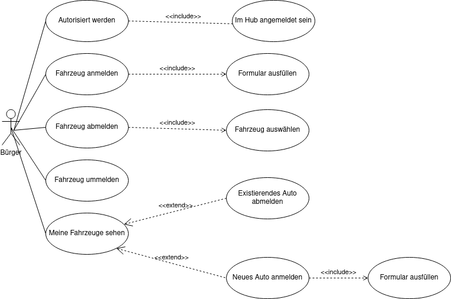
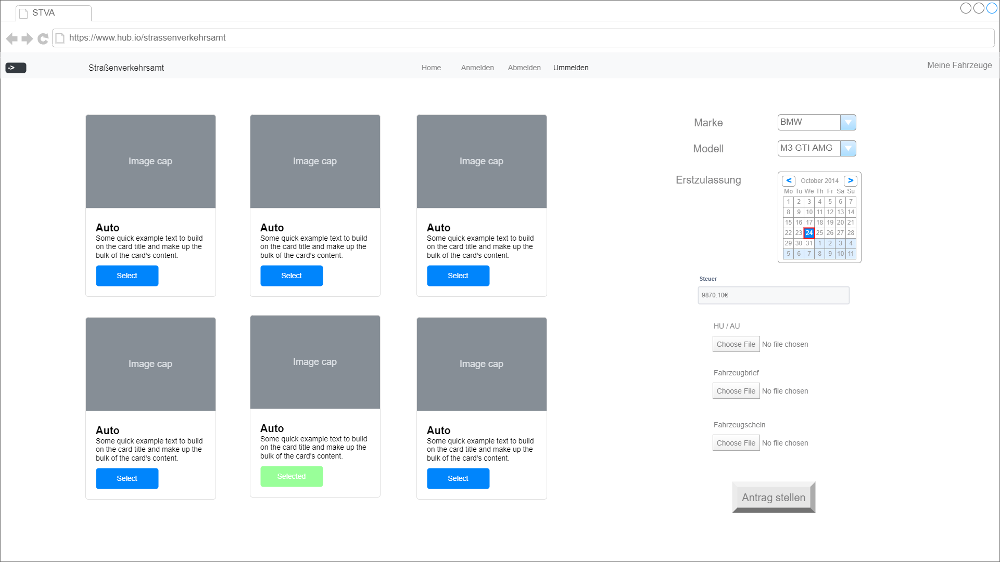
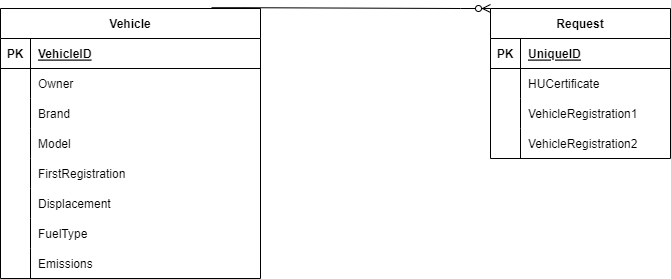

# Straßenverkehrsamt

**Autor:** Kevin Fischer

## Überblick

- Der Microservice Straßenverkehrsamt soll einem Benutzer ermöglichen, alle wichtigen Tätigkeiten innerhalb des Amtes digital erledigen zu können.
- Konzeptionelles Analyseklassendiagramm (logische Darstellung der Konzepte der Anwendungsdomäne)

## Funktionale Anforderungen

* Definition der Akteure
* Use-Case Diagramme
* Strukturierung der Diagramme in funktionale Gruppen
* Akteure sowie andere Begriffe der implementierten Fachdomäne definieren 
* Begriffe konsistent in der Spezifikation verwenden  
* Begriffe im Glossar darstellen

**Definition der Akteure**

- Bürger
  - Ein im HUB registrierter Benutzer, der über normale Berechtigungen verfügt
- Sachbearbeiter
  - Ein Bearbeiter, der die Anträge eines Bürgers bearbeitet

**Use-Case Diagramm**

## Anforderungen im Detail

**User Stories**

| **Name**| **In meiner Rolle als**...|   ...**möchte ich**...   | ..., **so dass**... | **Erfüllt, wenn**... | **Priorität**   |
|:-----|:----------:|:-------------------|:-------------|:---------|:----------------|
| Authentifizierung  |Benutzer| meine Identität bestätigt bekommen|ich Handlungen unter meinen Namen tätigen kann| meine Daten angezeigt werden | Muss |
| Übersicht | Benutzer | eine Übersicht über alle Funktionen bekommen | ich schnell zu jeder Funktion gelangen kann | ich die Home-Page erreiche | Muss |
| Auto anmelden | Benutzer  | neue Autos anmelden können  | diese offiziell zugelassen sind | ein Antrag auf Zulassung gestellt wurde | Muss  |
| Auto abmelden | Benutzer  | bereits registriertes Auto abmelden | dieses nicht mehr in meinen Daten erscheint | Auto aus Datenbank gelöscht | Muss  |
| Auto ummelden | Benutzer  | bereits registriertes Kennzeichen auf anderes Auto umschreiben  | das gleiche Kennzeichen auf anderes Auto gemeldet ist | Anfrage auf Ummeldung erstellt wurde  | Muss  |
| Autos anzeigen  | Benutzer  | Autos die auf meinen Namen registriert sind anzeigen  | ich dieses mit ihren Details sehen kann | Autos in meinen Daten dargestellt werden | Muss |
| Anfragen bearbeiten | Sachbearbeiter  | Anfragen auf An- und Ummeldungen bearbeiten können  | diese genehmigt oder abgelehnt werden können  | Einträge in DB gelöscht / geändert / hinzugefügt werden | Optional  |

**Misuse Stories**

- Der Service ist NICHT dazu gedacht, sich allgemeine Informationen über Fahrzeuge zu beschaffen
- Der Service wird die Anträge (voraussichtlich) NICHT vollautomatisch bearbeiten, ein Sachbearbeiter ist immernoch von Nöten
- Der Service bietet keine direkte Konservation zwischen Bürger und Bearbeiter

## Graphische Benutzerschnittstelle

- GUI-Mockups passend zu User Stories
- Screens mit Überschrift kennzeichnen, die im Inhaltsverzeichnis zu sehen ist
- Unter den Screens darstellen (bzw. verlinken), welche User Stories mit dem Screen abgehandelt werden
- Modellierung der Navigation zwischen den Screens der GUI-Mockups als Zustandsdiagramm
- Mockups für unterschiedliche Akteure

### Übersicht

### Auto anmelden

### Auto abmelden

### Auto ummelden

### Autos anzeigen

## Datenmodell 

- Begriffe im Glossar darstellen
- Modellierung des physikalischen Datenmodells 
  - RDBMS: ER-Diagramm bzw. Dokumentenorientiert: JSON-Schema

**Entity Relationship Model**

## Abläufe

- Aktivitätsdiagramm für den Ablauf sämtlicher Use Cases
- Aktivitätsdiagramme für relevante Use Cases
- Aktivitätsdiagramm mit Swimlanes sind in der Regel hilfreich 
  für die Darstellung der Interaktion von Akteuren der Use Cases / User Stories
- Abläufe der Kommunikation von Rechnerknoten (z.B. Client/Server)
  in einem Sequenz- oder Aktivitätsdiagramm darstellen
- Modellieren Sie des weiteren die Diagramme, die für das (eigene) Verständnis des
  Softwaresystems hilfreich sind. 

## Schnittstellen

- Schnittstellenbeschreibung (API), z.B. mit OpenAPI 
- Auflistung der nach außen sichtbaren Schnittstelle des Microservices. Über welche Schnittstelle kann z.B. der Client den Server erreichen?
- In Event-gesteuerten Systemen ebenfalls die Definition der Ereignisse und deren Attribute
- Aufteilen in Commands, Events, Queries
* Abhängigkeiten: Liste mit Kommunikationsabhängigkeiten zu anderen Microservices

**Beispiel:**

### URL

http://smart.city/microservices/customer

### Commands

**Synchronous**

| **Name** | **Parameter** | **Resultat** |
| :------ | :----- | :------ |
| createCustomer() | int id | int id |
| deleteOrder() | int id | int id |

**Asynchronous**

| **Name** | **Parameter** | **Resultat** |
| :------ | :----- | :------ |
| createContract() | int id | int id |
| changeContract() | int id | - |

### Events

**Customer event channel**

| **Name** | **Payload** | 
| :------ | :----- | 
| Customer Authorized | int id |
| Customer Deleted | int id |

**Contract event channel**

| **Name** | **Payload** | 
| :------ | :----- | 
| Contract Received | int id |
| Contract Deleted | int id |

### Queries

| **Name** | **Parameter** | **Resultat** |
| :------ | :----- | :------ |
| getContracts() | - | Contract [] list |
| getContract() | int id | Contract c |

### Dependencies

#### RPC

| **Service** | **Funktion** |
| :------ | :----- | 
| Authorization Service | authenticateUser() |
| Hospital Service | blockDate() |

#### Event-Subscriptions

| **Service** | **Funktion** |
| :------ | :----- | 
| Cinema channel | CancelFilmCreatedEvent |
| Customer reply channel | CreateCustomerEvent |

## Technische Umsetzung

### Softwarearchitektur

- Darstellung von Softwarebausteinen (Module, Schichten, Komponenten)

Hier stellen Sie die Verteilung der Softwarebausteine auf die Rechnerknoten dar. Das ist die Softwarearchitektur. Zum Beispiel Javascript-Software auf dem Client und Java-Software auf dem Server. In der Regel wird die Software dabei sowohl auf dem Client als auch auf dem Server in Schichten dargestellt.

* Server
  * Web-Schicht
  * Logik-Schicht
  * Persistenz-Schicht

* Client
  * View-Schicht
  * Logik-Schicht
  * Kommunikation-Schicht

Die Abhängigkeit ist bei diesen Schichten immer unidirektional von "oben" nach "unten". Die Softwarearchitektur aus Kapitel "Softwarearchitektur" ist demnach detaillierter als die Systemübersicht aus dem Kapitel "Systemübersicht". Die Schichten können entweder als Ganzes als ein Softwarebaustein angesehen werden. In der Regel werden die Schichten aber noch weiter detailliert und in Softwarebausteine aufgeteilt. 

### Entwurf

- Detaillierte UML-Diagramme für relevante Softwarebausteine

### Fehlerbehandlung 

* Mögliche Fehler / Exceptions auflisten
* Fehlercodes / IDs sind hilfreich
* Nicht nur Fehler technischer Art ("Datenbankserver nicht erreichbar") definieren, sondern auch fachliche Fehler wie "Kunde nicht gefunden", "Nachricht wurde bereits gelöscht" o.ä. sind relevant. 

### Validierung

* Relevante (Integrations)-Testfälle, die aus den Use Cases abgeleitet werden können
* Testfälle für 
  - Datenmodell
  - API
  - User Interface
* Fokussieren Sie mehr auf Integrationstestfälle als auf Unittests
* Es bietet sich an, die IDs der Use Cases / User Stories mit den Testfällen zu verbinden,
  so dass erkennbar ist, ob Sie alle Use Cases getestet haben.

### Verwendete Technologien

- Frontend
  - HTML5, CSS und Java Script mittels ReactJS Framework
- Backend
  - Python, Framework entweder Django oder FastAPI
- Datenbank
  - MySQL, wahrscheinlich MariaDB
