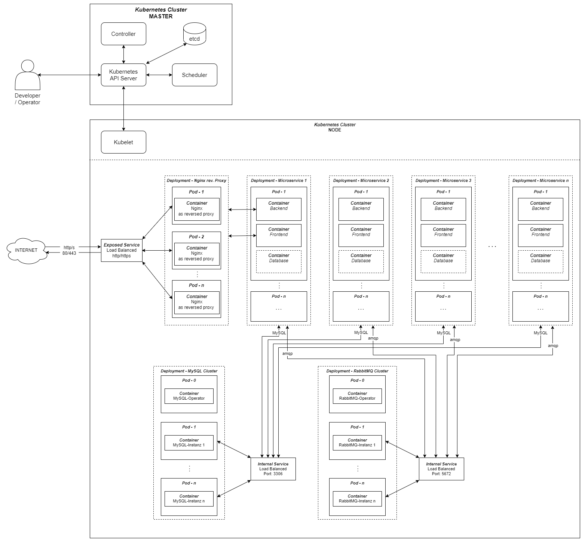
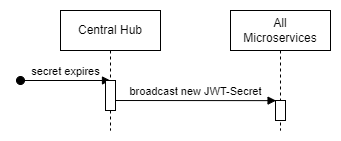

# Projektübersicht *Smart City*

**Autor:** Patrick Mayer, Finn Amini Kaveh, Justin Kühnel

## Beschreibung

SmartCity ist ein Projekt, das darauf abzielt, eine Stadt weitestgehend zu digitalisieren. Dies bedeutet auch, dass eine SmartCity in gewisser Hinsicht
autonom handeln kann und Entscheidungen interaktiv getroffen werden. Durch einen zentralen Aufbau ist die Stadt damit übersichtlich und komfortabel
bei der Bedienung.

## Github Repository

https://github.com/SmartCity-2022

## Ziele

Ziel des SmartCity Projekts ist es, eine Stadt modern und digital zu gestalten. Dazu gehört eine zentrale Informationsverwaltung, in einem sogenannten 
"Hub", sowie eine transparente Einsicht in die Prozesse und Verwaltung einer SmartCity für ihre Bürger. Die Motivation dahinter ist es, das Leben in 
solch einer Stadt durch Digitalisierung zu erleichtern und Prozesse zu automatisieren. Ebenso soll durch die Digitalisierung bürokratischer Prozesse der
Beruf des Beamten automatisiert werden. Auch kann durch den übersichtlichen Ablauf der SmartCity die Stadt weiter demokratisiert, bzw. ihre Einwohner
dazu angeregt werden, mehr am demokratischen Prozess teilzunehmen. Dieses Projekt umfasst hauptsächlich alle Prozesse, die regional in einer Stadt ablaufen. Dies
beinhaltet bestimmte Ämter wie das Straßenverkehrsamt, Bauamt und Gesundheitsamt sowie essenzielle Portale einer Stadt, wie das Kulturportal, Bildungsportal,
Bankenportal und weitere. Unsere SmartCity unterscheidet sich damit stark von einer herkömmlichen Stadt, da sie nicht, wie es gängig wäre, vor Ort und 
dezentralisiert verwaltet wird, sondern digital und mehrheitlich automatisiert.

Die Zielgruppe beschränkt sich in einer SmarCity auf die Einwohner ihrer Stadt sowie all ihrer Gäste. Dabei spielt es keine Rolle welcher Klasse,
Bildungsgrad oder politischen Hintergrund ihre Einwohner entspringen. Alle Einwohner werden gleichermaßen gehandhabt.

SmartCity grenzt sich somit von gängigen Städten über eine höhere Digitalisierungsrate sowie einen großen Bezug zur Informationsfreiheit und einer hohen Transparenz bezüglich bürokratischer Abläufe ab.

## Risiken

| SWOT-Analyse| Hilfreich | Schädlich |
|---|---|---|
| <b>Intern</b> | <b>Stärken:</b> Digitalisierung, Automatisierung, Komfortabilität| <b>Schwächen:</b> Datenschutzrechtliche Bedenken, Externe Vulnerabilität  |
| <b>Extern</b>| <b>Möglichkeiten:</b> Stadterweiterung, Verbesserte Lebensbedingungen | <b>Gefahren:</b> Cyberangriff, Datenschutzdiebstahl, Datenmissbrauch

Risiken könnten sich bei der Entwicklung der Anwendung sowie der Benutzung ergeben. Dabei kann es zu Sicherheitslücken kommen, wenn die einzelnen Services, sowie der Hub keine umfangreiche Validierung der Daten vornehmen. Zudem ist es wichtig eine sichere Authentifizierung zu implentieren, um eventuellen Angriffen und unberechtigten Zugriffen vorzubeugen. Dies gilt insbesondere für die Kommunikation der Microservices mit dem Hub und umgekehrt, da zu jedem Zeitpunkt garantiert werden muss, dass die benötigten Rechte vorliegen. 
Die Validierung spielt insbesondere eine große Rolle, um SQL-Injections und Cross-Site-Scripting Angriffe zu verhindern. Neben den Risiken müssen ebenfalls die Synchronisation der Daten und ein regelmäßiger Austausch zwischen den Services gewährleistet sein. Dies ist insbesondere wichtig, damit keine Inkonsistenzen in den Daten zwischen den einzelnen Microservices entstehen. Um dieses Problem zu vermeiden muss mit einem Event System gearbeitet werden, bei dem sich die Microservices untereinander vernetzen und bei Datenänderungen gegenseitig informieren. 

## Stakeholder

| Funktion / Relevanz | Name | Kontakt / Verfügbarkeit | Wissen  | Interessen / Ziele  | 
|---|---|---|---|---|
| Administrator, DevOps  |  Niklas Schumann | Verfügbarkeit 100%, telefonisch und email  | Umgang mit Github-Repos, Docker, CI/CD und vertraut mit Infrastrukturqualität | Korrekter Umgang mit Repos, Vollständige Dokumentation des Projekts  |  
| Software Architekt | Finn Watermann  | Verfügbarkeit 100%, telefonisch und email  | Vertraut mit der Microservicesoftware, Technische Expertise  |  Stabiles System, geringer Wartungsaufwand, Softwarequalität und Funktionalität | 
| Product-Owner, Entscheider - als Koordinator der Stakeholderanforderungen   | Justin Kühnel  |  Verfügbarkeit 100%, telefonisch und email  | Koordinator für die Inputs der Stakeholder  | ROI des Systems sicherstellen  |
| Scrum-Master, Leiter des Projekts   | Finn Amini Kaveh / Patrick Mayer  |  Verfügbarkeit 100%, telefonisch und email  | Leiter und Organisator des SmartCity Projektes  | Richtigkeit des Software-Developing Prozesses zu garantieren  |
| Software Engineer   | Dennis Edler |  Verfügbarkeit 100%, telefonisch und email  | Vertraut mit Microservice Mobilitäts Hub  | Vollständig Umsetzung des Microservice  |
| Software Engineer   | Ben-Lukas Horn |  Verfügbarkeit 100%, telefonisch und email  | Vertraut mit Microservice Polizei  | Vollständig Umsetzung des Microservice  |
| Software Engineer   | Nico Hübner |  Verfügbarkeit 100%, telefonisch und email  | Vertraut mit Microservice Kulturportal  | Vollständig Umsetzung des Microservice  |
| Software Engineer   | Fabian Pechta |  Verfügbarkeit 100%, telefonisch und email  | Vertraut mit Microservice Immobilienportal  | Vollständig Umsetzung des Microservice  |
| Software Engineer   | Patrick Hüntelmann |  Verfügbarkeit 100%, telefonisch und email  | Vertraut mit Microservice Bildungsportal  | Vollständig Umsetzung des Microservice  |
| Software Engineer   | Finn Bechinka |  Verfügbarkeit 100%, telefonisch und email  | Vertraut mit Microservice Bürgerbüro  | Vollständig Umsetzung des Microservice  |
| Software Engineer   | Clemens Vogtländer |  Verfügbarkeit 100%, telefonisch und email  | Vertraut mit Microservice Jobportal  | Vollständig Umsetzung des Microservice  |
| Software Engineer   | Maurice Leenders |  Verfügbarkeit 100%, telefonisch und email  | Vertraut mit Microservice Gesundheitsamt  | Vollständig Umsetzung des Microservice  |
| Software Engineer   | Dennis Gorpinic |  Verfügbarkeit 100%, telefonisch und email  | Vertraut mit Microservice Bankenportal  | Vollständig Umsetzung des Microservice  |
| Software Engineer   | Marc Leenders |  Verfügbarkeit 100%, telefonisch und email  | Vertraut mit Microservice Bauamt  | Vollständig Umsetzung des Microservice  |
| Software Engineer   | Kevin Fischer |  Verfügbarkeit 100%, telefonisch und email  | Vertraut mit Microservice Straßenverkehrsamt  | Vollständig Umsetzung des Microservice  |
| Software Engineer   | Finn Amini Kaveh / Patrick Mayer / Justin Kühnel |  Verfügbarkeit 100%, telefonisch und email  | Vertraut mit Microservice Zentrales Hub  | Vollständig Umsetzung des Microservice  |

## Systemübersicht

<!--Dieser Abschnitt zeigt die technische Beschreibung des Softwaresystems
in Form eines Systemarchitekturdiagramms.
Das Diagramm ist statisch und nicht dynamisch und stellt daher keine Abläufe dar. Abläufe werden im Kapitel "Abläufe" dargestellt. Im Kapitel "Systemübersicht" soll genau ein Diagramm dargstellt werden. Das "Box-and-Arrow"-Diagramm soll als Systemarchitekturdiagramm eine abstrakte Übersicht über das Softwaresystem geben. Dazu stellt es die Rechnerknoten und deren Kommunikationsbeziehungen (Protokoll (z.B. HTTP), Datenformat (z.B. JSON)) dar. Also Rechtecke und gerichtete Pfeile. Ähnlich einem UML-Deployment-Diagramm, aber noch abstrakter, denn es zeigt nicht die Verteilung der Softwarebausteine auf die Rechnerknoten. So erlangt der Leser einen schnellen und guten Überblick über das Softwaresystem.-->



## Kommunikationsprotokolle und Datenformate

### RabbitMQ - Events

Alle Events, die über RabbitMQ gesendet werden, müssen in einem vorgegebenen JSON-Format versendet werden:
```json
{
  "event": {
    "name": "event_name",
    "sender": "sender_name",
    "timestamp": 1011567600, //Unix-Timestamp (in seconds)
    "payload": {
      //Payload of Event in JSON-Format
    }
  }
}
```
**Beispiel:**
```json
{
  "event": {
    "name": "new_citizen",
    "sender": "Bürgerbüro-i324",
    "timestamp": 1011567600,
    "payload": {
      "citizen_id": "00000000-0000-4000-0000-000000000001",
      "firstname": "Max",
      "lastname": "Mustermann",
      "address": "Musterstraße 1",
      "birthday": "01.01.1970",
  }
}
```

## Funktionale Anforderungen 

**Akteure**
| **Akteur** | **Definition** |
| :--------- | :----- |
| Benutzer | Angemeldeter Benutzer mit grundlegenden Berechtigungen |
| Gast | Nicht angemeldeter Besucher mit eingeschränkten Berechtigungen |

- Benutzer und Gäste müssen in der Lage sein, zwischen den einzelnen Microservices zu navigieren
- Benutzer und Gäste müssen in der Lage sein, einen Microservice auszuwählen, um mit diesem zu interagieren
- Gäste müssen in der Lage sein, sich in der Anwendung zu registrieren
- Es muss möglich sein, dass sich Benutzer mit ihren Anmeldedaten in der Anwendung anmelden können
- Die Anwendung muss rechtliche- sowie Kontaktinformationen bereitstellen

## Abläufe

<!--- Abläufe der Kommunikation von Microservices
  in Sequenz- oder Aktivitätsdiagramm darstellen-->

- Die Kommunikation von Microservices untereinander sollte so weit wie möglich vermieden werden. Jeglich Event Messaging via RabbitMQ sollte von den Microservices zum Austausch von Informationen verwendet werden.

- Um die Autorisierung eines angemeldeten Benutzer für jeden einzelnen Microservice zu ermöglichen, werden JWT Tokens verwendet.

  - JWT Tokens sind mit einem Secret signiert, welches vom `CentralHub`-Microservice verwaltet und über den Event-Bus verteilt wird.
  Mit hilfe des Secrets kann ein Microservice die Echtheit des Tokens prüfen und damit die Autorisierung eines Benutzers für den jeweiligen Microservice durchführen.



## Nicht-funktionale Anforderungen 

### Rahmenbedingungen

<!--- Normen, Standards, Protokolle, Hardware, externe Vorgaben-->

- Das Softwareprodukt soll ein verteiltes System darstellen, bei dem jeder Microservice ein in sich geschlossenes System aus Frontend, Backend und Datenbank ist, wobei alle Microservices über ein Event-System mit einem zentralen Hub kommunizieren. 
- Die Kundendaten sollen zentral verwaltet werden und bei Änderungen der Kundendaten werden alle, bzw. eine ausgewählte Gruppe von Microservices über diese Änderung benachrichtigt.
- Als Kommunikationsprotokoll soll https genutzt werden
- Das interne Datenformat ist json, bzw. jwt
- Innerhalb des gesamten Systems, sowie aller Microservices muss backendseitig validiert werden, sodass kein schädlicher Code eingepflegt werden kann

- Protokolle
  - AMQP 0-9-1: Event Messaging via RabbitMQ
  - HTTP/S: Übertragung von Inhalten zwischen Server/Client
  - MySQL: Datenbankanbindung (nur Intern)

### Betriebsbedingungen
- Die Software muss in allen modernen Browser voll funktional sein, welche in der Lage sind HTML5 zu interpretieren. Explizit ausgeschlossen wird hier der Internet Explorer.
- Für das zentrale Hub werden HTML5, CSS3 und Javascript, bzw. React.js für das Frontend, Node.js für das Backend und MySQL als Datenbanksystem genutzt. Die einzelnen Microservices werden jeweils mit unterschiedlichen Tech-Stacks entwickelt, wobei diese geneuer in den jeweiligen Spezifikationen definiert sind

### Qualitätsmerkmale

Qualitätsmerkmal | sehr gut | gut | normal | nicht relevant
---|---|---|---|---
**Zuverlässigkeit** | | | | |
Fehlertoleranz |X|-|-|-|
Wiederherstellbarkeit |-|X|-|-|
Ordnungsmäßigkeit |X|-|-|-|
Richtigkeit |X|-|-|-|
Konformität |-|X|-|-|
**Benutzerfreundlichkeit** | | | | |
Installierbarkeit |-|X|-|-|
Verständlichkeit |X|-|-|-|
Erlernbarkeit |X|-|-|-|
Bedienbarkeit |X|-|-|-|
**Performance** | | | | |
Zeitverhalten |-|-|X|-|
Effizienz|-|-|X|-|
**Sicherheit** | | | | |
Analysierbarkeit |X|-|-|-|
Modifizierbarkeit |-|X|-|-|
Stabilität |X|-|-|-|
Prüfbarkeit |-|X|-|-|


## Glossar 

- Definitionen, Abkürzungen, Begriffe

## Referenzen

* Handbücher, Gesetze
* z.B. Datenschutzgrundverordnung


