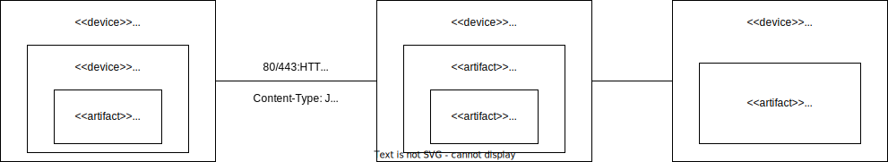

# Bankenportal

**Autor:** Dennis Gorpinic

## Überblick

Ein Banken Microservice für Nutzer der SmartCity-Webseite.
Dieser Mircoservice bietet die Dienstleistung einer Bank wie die Eröffnung und Verwaltung von Konten, die möglichkeit Geld an andere Konten zu senden und Geld zu empfangen, ein Karte zu beantragen um bargeldlos zu zahlen. Desweiteren soll eine Suche angeboten werden um Filialen und Geldautomaten in der Nähe zu finden.

## Funktionale Anforderungen

### Akteure
* Benutzer
* (Berater)

## Anforderungen im Detail

| **Name** | **Priorität** | **Als** | **möchte ich** | **so dass** | **Akzeptanz** |
| :------ | :------| :------ | :----- | :------ | :-------- |
| Konto eröffnen | Muss| Benutzer| ein Konto eröffnen können| ich ein Konto habe| Konto für den Benutzer freigeschaltet |
| Konto löschen | Muss| Benutzer| ein Konto löschen können| überflüssige Konten aussortieren kann| Konto nicht mehr existiert |
| Konto einsehen | Muss| Benutzer| Details des Kontos sehen | ich ein wichtige Infos über das Konto einsehen kann z.B. Guthaben| Kontodetailansicht|
| Kontenübersicht| Muss| Benutzer| alle meine Konten sehen in einer Übersicht | ich einen Überblick habe über meine Konten| Kontenübersicht|
| Kontosperrung| Muss| Benutzer| ein Konto sperren können ohne das es gelöscht wird | ich im Notfall keine Transaktionen auf meinem Konto ausgeführt werden können| Sperren-Button|
| Transaktionen| Muss| Benutzer| Transaktionen an/von andere(n) Konten senden/empfangen | ich z.B. Geld an/von andere(n) Konten überweisen/erhalten kann| Transaktionsfenster|
| Karten beantragen| Sollte| Benutzer| eine Karte beantragen | ich überall Zahlen kann ohne Bargeld mitzuführen| Karten beantragen Button|
| Filialen/Geldautomaten finden| Sollte| Benutzer| ein Überblick mit Filialen/Geldautomaten | eine Filiale/Geldautomaten in meiner Nähe finden| Liste mit Filialen/Geldautomaten|
| Dokumente hochladen| Kann| Benutzer| Dokumente hochladen | ich benötigte Dokumente Digital zur Verfügung stellen kann| Hochlade-Funktion|
| Dokumentenübersicht| Kann| Benutzer| alle meine Dokumente einsehen | ich einen Überblick über meine Dokumenten habe | Dokumentenübersicht|
| Dokumente löschen| Kann| Benutzer| unnötige Dokumente löschen| nicht relevante oder veraltete Dokumente löschen kann | Lösch-Button Dokumente|
| Berater kontaktieren| Kann| Benutzer| meinen Berater über einen Chat kontaktieren| ich persönliche Hilfe bekommen kann bei Problemen oder Fragen | Berater Chat|

## Graphische Benutzerschnittstelle

## Datenmodell 

## Schnittstellen

**URL**
https://bank.smartcity.w-mi.de/api

**Account Route**
| **Route** |  **Method** | **Consumes** | **Params** | **Produces** |
| :------ | :----- | :----- | :----- | :----- |
| /account |GET| 
-----------
|
-----------
 | Account Array|
| /account/:id |GET|
-----------
 | KontoID | Account Object|
| /account |POST| {name, iban, credit} |
-----------
 | Create Account |
| /account/:id |DELETE| 
-----------
| KontoID | Delete Account|

**Transaction Route**
| **Route** |  **Method** | **Consumes** | **Params** | **Produces** |
| :------ | :----- | :----- | :----- | :----- |
| /transaction |GET|
-----------
 |
-----------
 | Transaction Array|
| /transaction |POST| {amount, purposeofuse, receiverId} | 
-----------
| Create Transaction |
| /transaction/:id |DELETE| 
-----------
| TransactionID | Delete Transaction |

**Card Route**
| **Route** |  **Method** | **Consumes** | **Params** | **Produces** |
| :------ | :----- | :----- | :----- | :----- |
| /card |GET| 
-----------
|
-----------
 | Card Object|
| /card |POST| {expirydate} |
-----------
 | Create Card|
| /card/:id |DELETE|
-----------
 | CardID| Delete Card|

**Branchoffice Route**
| **Route** |  **Method** | **Consumes** | **Params** | **Produces** |
| :------ | :----- | :----- | :----- | :----- |
| /branchoffice |GET|
-----------
 |
-----------
 | Branchoffice List|
| /branchoffice/:id |GET|
-----------
 | BranchofficeID| Branchoffice Object|
| /branchoffice |POST| {name, address} |
-----------
 | Create Branchoffice |
| /branchoffice/:id |DELETE|
-----------
 | BranchofficeID| Delete Branchoffice |

**Consultant Route**
| **Route** |  **Method** | **Consumes** | **Params** | **Produces** |
| :------ | :----- | :----- | :----- | :----- |
| /consultant |GET|
-----------
 |
-----------
 | Consultant List|
| /consultant/:id |GET|
-----------
 | ConsultantID | Consultant Object|
| /consultant |POST| {name, address} |
-----------
 | Create Consultant |
| /consultant/:id |DELETE|
-----------
 | ConsultantID | Delete Consultant |

## Technische Umsetzung

### Softwarearchitektur

* **Server**
  * Web-Schicht
    * JavaScript / Express.js
  * Logik-Schicht
    * Node.js
    * Sequelize
  * Persistenz-Schicht
    * MySQL Datenbank

* **Client**
  * View-Schicht
    * HTML
    * CSS
  * Logik-Schicht
    * JavaScript / React.js
  * Kommunikation-Schicht
    * HTTP

### Verwendete Technologien
* **Frontend**
  * React.js
  * MUI
* **Backend**
  * Node.js
  * Express.js
  * Sequelize
* **Datenbank**
  * MySQL
