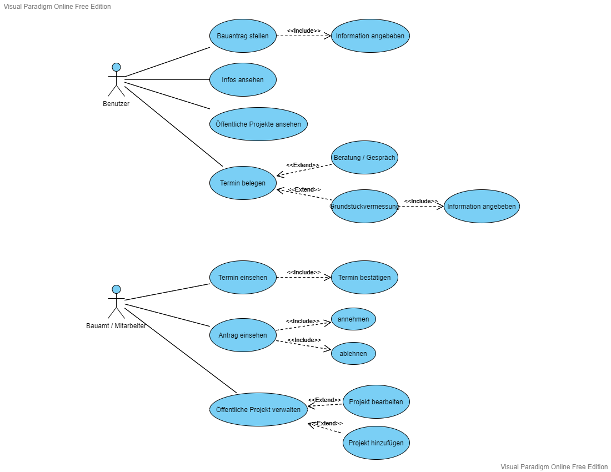
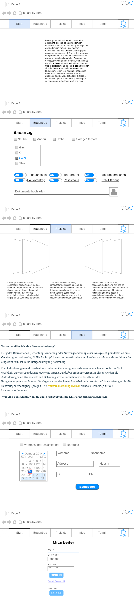
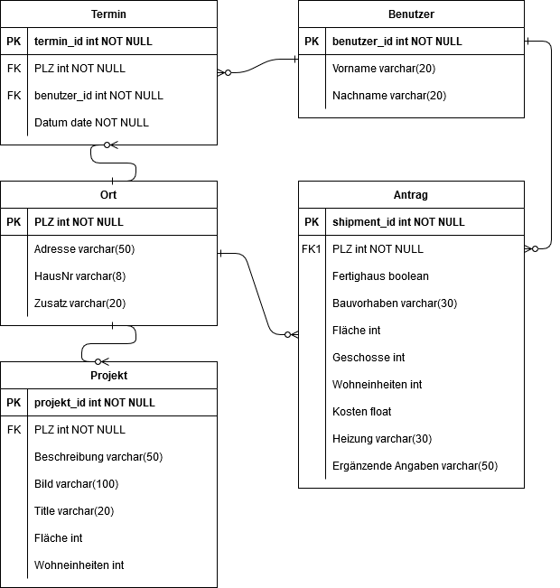
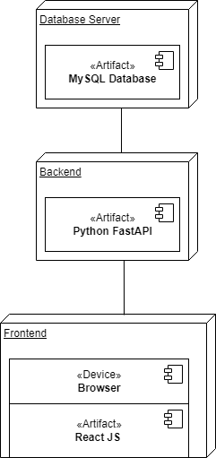

# Bauamt

**Autor:** Marc Leenders

## Überblick

- Der Microservice Bauamt soll einem Benutzter ermöglichen, alle Tätigkeiten eines Bauamtes digital erledigen zu können.
- Konzeptionelles Analyseklassendiagramm (logische Darstellung der Konzepte der Anwendungsdomäne)

## Funktionale Anforderungen

**Akteure** 

| **Akteur** | **Definition** |
| :------ | :----- |
| Benutzer | Angemeldeter Benutzer mit grundlegenden Berechtigungen |
| Mitarbeiter | Sachbearbeiter des Bauamts mit zusätzlichen Berechtigungen für die Bearbeitung und Einsicht |

## Anforderungen im Detail

- Strukturierung der User Stories in funktionale Gruppen
- Sicherheit: Misuse-Stories formulieren

**User Stories**

| **Name**| **In meiner Rolle als**...|   ...**möchte ich**...   | ..., **so dass**... | **Erfüllt, wenn**... | **Priorität**   |
|:-----|:----------:|:-------------------|:-------------|:---------|:----------------|
| Authentifizierung |Benutzer| meine Identität bestätigt bekomme | ich Handlungen unter den Benutzer tätigen kann | Die Daten des Benutzers angezeigt werden | Muss |
| Antrag stellen | Benutzer | Einen Bauantrag in meinem Namen stellen | ich lernen kann | Datensatz erfolgreich in die Datenbank eingefügt wird | Muss |
| Vermessung beantragen | Benutzer | Einen Termin für die Vermessung eines Grundstücks belegen | Dieser Termin festgelegt ist | Datensatz erfolgreich in die Datenbank eingefügt wird | Muss |
| Beratung Termin | Benutzer | Einen Termin für ein Gespräch oder Beratung belegen | Dieser Termin festgelegt ist | Datensatz erfolgreich in die Datenbank eingefügt wird | Muss |
| Projekte ansehen | Benutzer | Anzeigen aller öffentlichen Bauprojekte des Bauamts | ich lernen kann | Daten angezeigt werden | Muss |
| Informationen ansehen | Benutzer | Anzeigen der Information für die behördlichen Formalitäten | ich lernen kann | Daten angezeigt werden | Muss |
| Termin einsehen | Mitarbeiter | Das der Mitarbeiter einsicht auf alle Termine hat | ich lernen kann | Daten angezeigt werden | Muss |
| Antrag einsehen | Mitarbeiter | Das der Mitarbeiter einsicht auf alle Bauanträge hat | ich lernen kann | Daten angezeigt werden | Muss |
| Termin bestätigen | Mitarbeiter | Das der Mitarbeiter einen Termin bestätigen | Der Termin festgelegt ist | Termin ist als bestätigt in der Datenbank eingetragen | Muss |
| Antrag bearbeiten | Mitarbeiter | Das der Mitarbeiter einen gestellten Bauantrag abarbeiten kann und danach diesen annehmen oder ablehnen kann. | Der Bauantrag bearbeitet wurde | Bauantrag ist als abgearbeitet in der Datenbank eingetragen | Sollte |
| Projekt hinzufügen | Mitarbeiter | Das der Mitarbeiter ein öffentliches Projekt hinzufügen kann | Dieses Projekt bei den öffentlichen Bauprojekten angezeigt wird | Daten angezeigt werden | Optional |
| Projekt bearbeiten | Mitarbeiter | Das der Mitarbeiter ein öffentliches Projekt bearbeiten und anpassen kann | Daten geändert werden können oder hinzugefügt werdeb können | Daten geändert oder hinzugefügt werden | Optional |

## Graphische Benutzerschnittstelle

- Screens mit Überschrift kennzeichnen, die im Inhaltsverzeichnis zu sehen ist
- Unter den Screens darstellen (bzw. verlinken), welche User Stories mit dem Screen abgehandelt werden
- Modellierung der Navigation zwischen den Screens der GUI-Mockups als Zustandsdiagramm
- Mockups für unterschiedliche Akteure

## Datenmodell 

- Begriffe im Glossar darstellen

**ERD**

## Abläufe

- Aktivitätsdiagramm für den Ablauf sämtlicher Use Cases
- Aktivitätsdiagramme für relevante Use Cases
- Aktivitätsdiagramm mit Swimlanes sind in der Regel hilfreich 
  für die Darstellung der Interaktion von Akteuren der Use Cases / User Stories
- Abläufe der Kommunikation von Rechnerknoten (z.B. Client/Server)
  in einem Sequenz- oder Aktivitätsdiagramm darstellen
- Modellieren Sie des weiteren die Diagramme, die für das (eigene) Verständnis des
  Softwaresystems hilfreich sind. 

## Schnittstellen

- **GET** ("/application") Gibt alle Bauanträge eines Benutzers
- **GET** ("/appointment") Gibt alle Termine eines Benutzers
- **GET** ("/application/{id}") Gibt einen bestimmten Bauanträge eines Benutzers
- **GET** ("/appointment/{id}") Gibt einen bestimmten Termine eines Benutzers
- **GET** ("/citizen") Gibt alle eingetragenen Benutzers [Testweise]
- **POST** ("/application/new") Erstellt einen neuen Bauantrag für den Benutzer
- **POST** ("/appointment/new") Erstellt einen neuen Termin für den Benutzer
- **PUT** ("/application/edit/{id}") Updatet einen Antrag von einem Benutzer
- **PUT** ("/appointment/edit/{id}") Updatet einen Termin von einem Benutzer
- **DELETE** ("/application/{id}/delete") Löscht einen bestimmten Antrag von einem Benutzer
- **DELETE** ("/appointment/{id}/delete") Löscht einen bestimmten Termin von einem Benutzer

### URL

https://smartcity.w-mi.de/Bauamt

### Events

| **Key** | **Beschreibung** | **Payload** | 
| :------ | :----- | :----- | 
| service.world | Wird verschickt sobald service.hello erhalten wurde | JWT Secret |
| service.hello | Wird verschickt sobald ein Service starten | Nachricht |

## Technische Umsetzung

### Softwarearchitektur

- Darstellung von Softwarebausteinen (Module, Schichten, Komponenten)

Hier stellen Sie die Verteilung der Softwarebausteine auf die Rechnerknoten dar. Das ist die Softwarearchitektur. Zum Beispiel Javascript-Software auf dem Client und Java-Software auf dem Server. In der Regel wird die Software dabei sowohl auf dem Client als auch auf dem Server in Schichten dargestellt.

* Server
  * Web-Schicht
  * Logik-Schicht
  * Persistenz-Schicht

* Client
  * View-Schicht
  * Logik-Schicht
  * Kommunikation-Schicht

Die Abhängigkeit ist bei diesen Schichten immer unidirektional von "oben" nach "unten". Die Softwarearchitektur aus Kapitel "Softwarearchitektur" ist demnach detaillierter als die Systemübersicht aus dem Kapitel "Systemübersicht". Die Schichten können entweder als Ganzes als ein Softwarebaustein angesehen werden. In der Regel werden die Schichten aber noch weiter detailliert und in Softwarebausteine aufgeteilt. 

### Fehlerbehandlung 

* Technische Fehler
  * Fehler 404 Not Found: Ein Account, Termin oder Bauantrag konnte nicht gefunden werden.
  * Fehler 422 Unprocessable Entity: Das Objekt was übergeben wird kann nicht verarbeitet werden.
  * Fehler 500 Internal Server Error: Der Server hat einen Fehler beim Verarbeiten der Anfrage
  * SQL-Error: Ein Fehler im Umgang mit der Datenbank ist aufgetreten.
  * Timeout Error: Zeitüberschreibung

### Validierung

| **Fall** | **Beschreibung** | **Testschritt** | **Ergebnis** | 
| :------ | :----- | :----- | :----- | 
| Bauen | Das Projekt muss erfolgreich gebaut und deployt werden | Das Projekt wird gestartet | Das starten wird erfolgreich ausgeführt ohne auftretende Fehler |
| Funktionalität | Alle Routen sowie die Middleware funktionieren | Alle Routen und somit auch die Middleware werden getestet | Erfolgreich oder durchgefallen |

Es muss grundsätzlich bevor jeder Route die Authentifizierung stattfinden um somit zu testen, ob die Berechtigung besteht um die Funktion auszuführen. Durch die Authentifizierung kriegt man außerdem den Benutzer aus der Payload den man für die Route dementsprechend brauch. Danach wird die Funktionalität der Route getestet in der man guckt, ob die Request mit den Userinputs auf richtigkeit validiert werden und somit erfolgreich in die Datenbank eingetragen werden können. Wenn alle diese Punkte erfolgreich abgeschlossen werden ist der Test erfolgreich.

### Verwendete Technologien

- Verwendete Technologien (Programmiersprachen, Frameworks, etc.)

* Frontend: React.js Bootstrap und oder Material UI
* Backend: Python FastApi
* Datenbank: MySQL

* Wichtige Libs: Sqlalchemy, Urllib3, Starlette, Pika, Jwt
