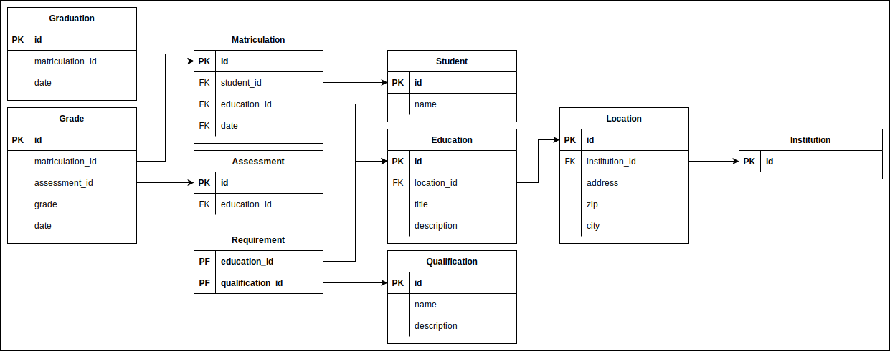

# Bildungsportal

**Autor:** Patrick Hüntelmann

## Überblick

## Funktionale Anforderungen

### Akteure

| **Akteur**  | **Definition**                                                                                                     |
|:------------|:-------------------------------------------------------------------------------------------------------------------|
| Benutzer    | Angemeldeter Benutzer mit grundlegenden Berechtigungen                                                             |
| Institution | Sachbearbeiter einer Institution mit zusätzlichen Berechtigungen für die Bearbeitung des eigenen Bildungsangebotes |

### Anwendungsfalldiagramm

## Anforderungen im Details

### User Stories

| **Als**     | **möchte ich**                           | **so dass**                                    | **Akzeptanz**                            | **Priorität** |
|:------------|:-----------------------------------------|:-----------------------------------------------|:-----------------------------------------|:--------------|
| Benutzer    | nach Bildungsangeboten suchen            | ich Angebote finde, welche mir gefallen        | Suche und Filterung der Bildungsangebote | Must          |
| Benutzer    | mich beim Bildungsangebot anmelden       | ich an dem Angebot teilnehmen kann             | Anmeldung an einem Bildungsangebot       | Must          |
| Benutzer    | Details eines Bildungsangebotes einsehen | ich mich über das Angebot informieren kann     | Detailanzeige eines Bildungsangebotes    | Should        |
| Benutzer    | Details einer Institution einsehen       | ich mich über die Institution informieren kann | Detailanzeige einer Institution          | Should        |
| Benutzer    | meine Benotung einsehen                  |                                                | Noteneinsicht                            | Should        |
| Benutzer    | meine Zeugnisse einsehen                 |                                                | Zeugniseinsicht                          | Should        |
| Institution | Bildungsangebote erstellen               | sich Benutzer bei dem Angebot anmelden können  | Erstellung eines Bildungsangebots        | Must          |
| Institution | Anmeldungen freigeben                    |                                                | Freigabe von Anmeldungen                 | Must          |
| Institution | Benotungen eintragen                     | ich die Benutzer benoten kann                  | Eintragung von Benotungen                | Should        |
| Institution | Zeugnis eintragen                        |                                                | Eintragung von Zeugnissen                | Should        |

## Graphische Benutzerschnittstelle

## Datenmodell

