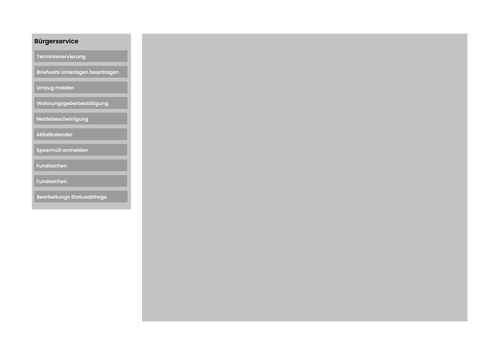
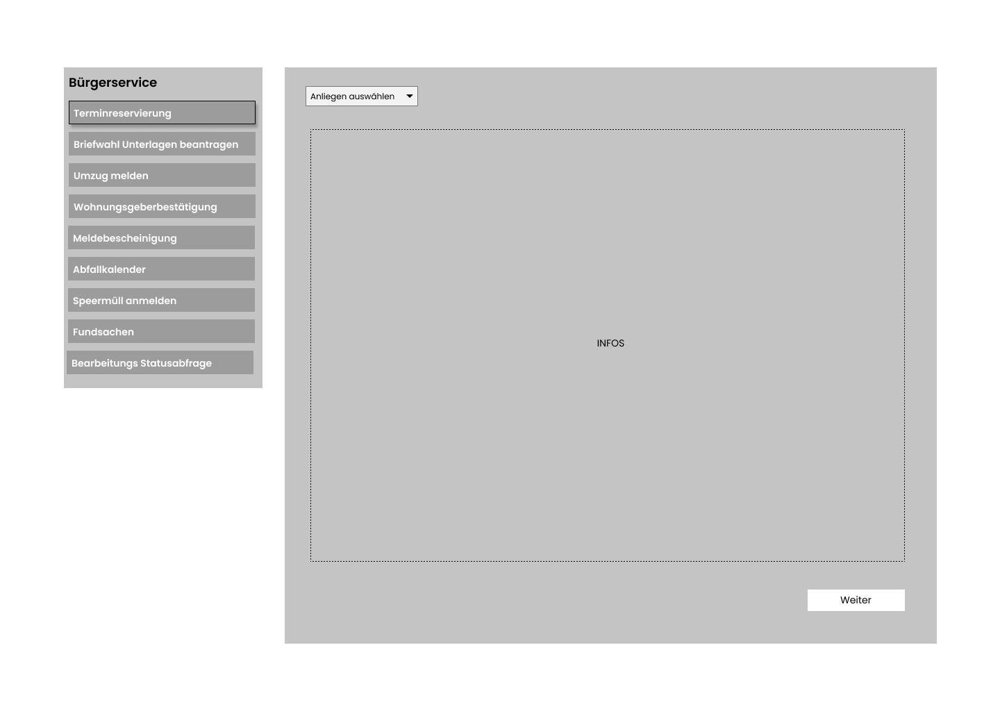
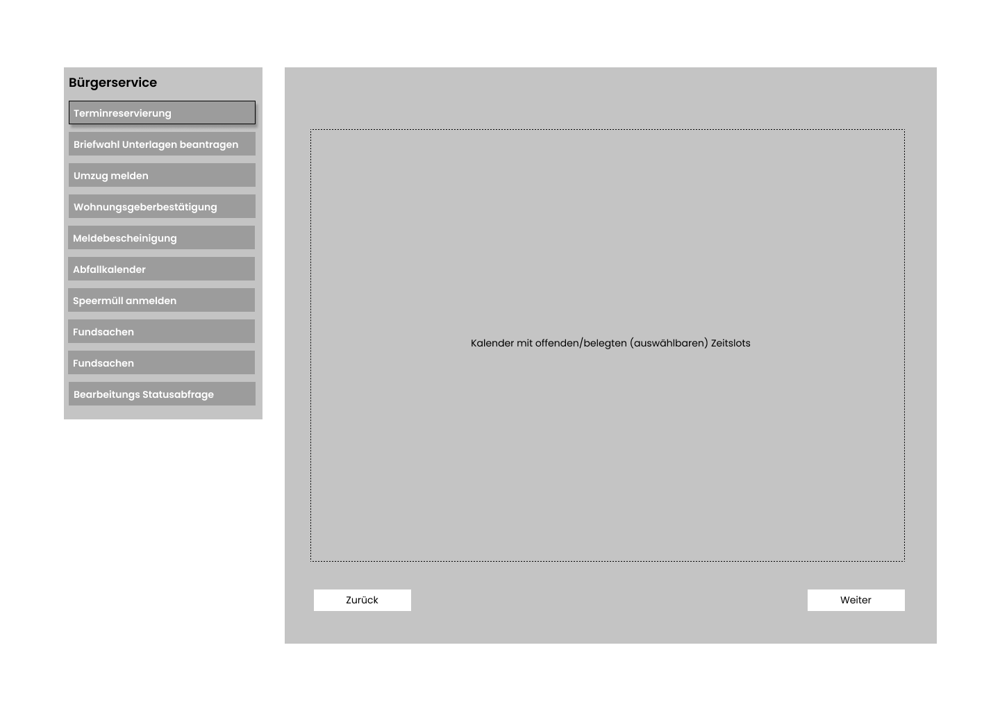
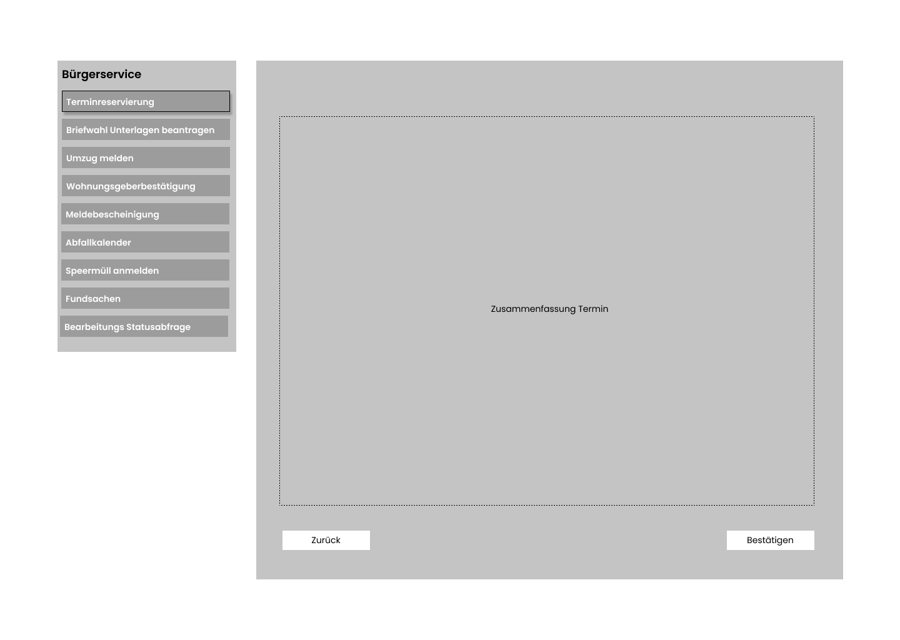

# Bürgerbüro

**Autor:** Finn Bechinka

## Überblick

Der Bürgerbüro Microservice soll Informationen und städtische Dienstleistungen zur Verfügung stellen.

## Funktionale Anforderungen

- Informationen bereitstellen
  - Abfallkalender
- Termine Vereinbaren
  - An- und Ummelden
  - Beantragung Ausweisdokumente
  - Belaubiegungen
  - Fischereischein
  - Ausländer-Angelegenheiten
  - Führerscheinangelegenheiten
- Speermüll Anmelden
- Meldebescheinigung
- Bearbeitungs Statusabfrage
- Briefwahlunterlagen Beantragen
- Wohnungsgeberbestätigung
- Umzug Melden
- Fundsachen einsehen

* __Akteure__:
  * Bürger
  * Stadt
  * Ämter

[USE CASE DIAGRAMM]

## Anforderungen im Detail

### User Stories

| **Als** | **möchte ich** | **so dass** | **Akzeptanz** |
| :------ | :----- | :------ | :-------- |
| Bürger | einen Termin vereinbaren | ich mein Anliegen besprechen kann | Termin wird gebucht |
| Bürger | meinen Umzug melden | ich keine Probleme bekomme | Umzug meldung möglich |
| Bürger | mich Informieren | ich informiert bin | Infoseiten existieren |
| Bürger | Fundsachen einsehen | ich gucken kann ob etwas was ich verlohren habe dabei ist | liste von Fundsachen einsehbar |

## Graphische Benutzerschnittstelle

## Datenmodell 

- Begriffe im Glossar darstellen
- Modellierung des physikalischen Datenmodells 
  - RDBMS: ER-Diagramm bzw. Dokumentenorientiert: JSON-Schema

## Abläufe

- Aktivitätsdiagramm für den Ablauf sämtlicher Use Cases
- Aktivitätsdiagramme für relevante Use Cases
- Aktivitätsdiagramm mit Swimlanes sind in der Regel hilfreich 
  für die Darstellung der Interaktion von Akteuren der Use Cases / User Stories
- Abläufe der Kommunikation von Rechnerknoten (z.B. Client/Server)
  in einem Sequenz- oder Aktivitätsdiagramm darstellen
- Modellieren Sie des weiteren die Diagramme, die für das (eigene) Verständnis des
  Softwaresystems hilfreich sind. 

## Schnittstellen

- Schnittstellenbeschreibung (API), z.B. mit OpenAPI 
- Auflistung der nach außen sichtbaren Schnittstelle des Microservices. Über welche Schnittstelle kann z.B. der Client den Server erreichen?
- In Event-gesteuerten Systemen ebenfalls die Definition der Ereignisse und deren Attribute
- Aufteilen in Commands, Events, Queries
* Abhängigkeiten: Liste mit Kommunikationsabhängigkeiten zu anderen Microservices

### Commands

**Synchronous**

| **Name** | **Parameter** | **Resultat** |
| :------ | :----- | :------ |

**Asynchronous**

| **Name** | **Parameter** | **Resultat** |
| :------ | :----- | :------ |

### Events

- Umzug gemeldet
- 

| **Name** | **Payload** | 
| :------ | :----- | 

| **Name** | **Payload** | 
| :------ | :----- | 

### Queries

| **Name** | **Parameter** | **Resultat** |
| :------ | :----- | :------ |

### Dependencies

- Authentifizierung

#### RPC

| **Service** | **Funktion** |
| :------ | :----- | 
| Authorization Service | authenticateUser() |

#### Event-Subscriptions

| **Service** | **Funktion** |
| :------ | :----- | 

## Technische Umsetzung

### Softwarearchitektur

* Server
  * Web-Schicht
    * HTTP
    * Express Routing
  * Logik-Schicht
    * Node.js
    * Sequelize
  * Persistenz-Schicht
    * MySQL Datenbank

* Client
  * View-Schicht
    * HTML
    * CSS
  * Logik-Schicht
    * React.js
  * Kommunikation-Schicht
    * HTTP

### Entwurf

### Fehlerbehandlung 

* Mögliche Fehler / Exceptions auflisten
* Fehlercodes / IDs sind hilfreich
* Nicht nur Fehler technischer Art ("Datenbankserver nicht erreichbar") definieren, sondern auch fachliche Fehler wie "Kunde nicht gefunden", "Nachricht wurde bereits gelöscht" o.ä. sind relevant. 

### Validierung

* Relevante (Integrations)-Testfälle, die aus den Use Cases abgeleitet werden können
* Testfälle für 
  - Datenmodell
  - API
  - User Interface
* Fokussieren Sie mehr auf Integrationstestfälle als auf Unittests
* Es bietet sich an, die IDs der Use Cases / User Stories mit den Testfällen zu verbinden,
  so dass erkennbar ist, ob Sie alle Use Cases getestet haben.

### Verwendete Technologien
* Frontend
  * React.js
* Backend
  * Node.js
* Datenbank
  * MySQL
