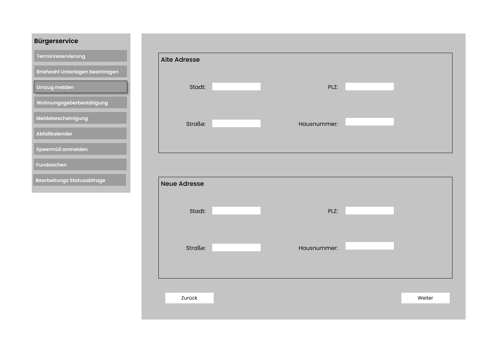
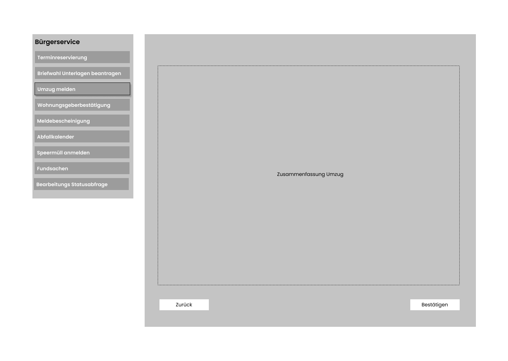
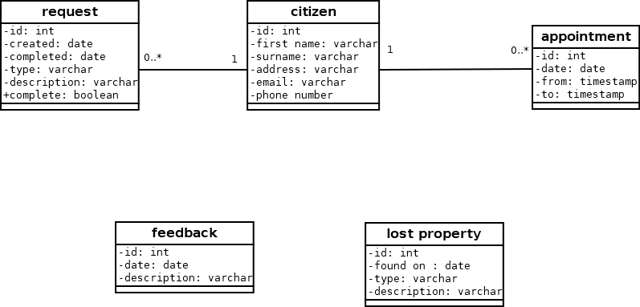

# Bürgerbüro

**Autor:** Finn Bechinka

## Überblick

Der Bürgerbüro Microservice soll Informationen und städtische Dienstleistungen zur Verfügung stellen.

## Funktionale Anforderungen

- Informationen bereitstellen
  - Abfallkalender
- Termine Vereinbaren
  - An- und Ummelden
  - Beantragung Ausweisdokumente
  - Belaubiegungen
  - Fischereischein
  - Ausländer-Angelegenheiten
  - Führerscheinangelegenheiten
- Speermüll Anmelden
- Meldebescheinigung
- Bearbeitungs Statusabfrage
- Briefwahlunterlagen Beantragen
- Wohnungsgeberbestätigung
- Umzug Melden
- Fundsachen einsehen

* __Akteure__:
  * Bürger
  * Stadt
  * Ämter

## Anforderungen im Detail

### User Stories

| **Als** | **möchte ich** | **so dass** | **Akzeptanz** |
| :------ | :----- | :------ | :-------- |
| Bürger | einen Termin vereinbaren | ich mein Anliegen besprechen kann | Termin wird gebucht |
| Bürger | meinen Umzug melden | ich keine Probleme bekomme | Umzug meldung möglich |
| Bürger | mich Informieren | ich informiert bin | Infoseiten existieren |
| Bürger | Fundsachen einsehen | ich gucken kann ob etwas was ich verlohren habe dabei ist | liste von Fundsachen einsehbar |
| Bürger | Briefwahl beantragen | über Briefwahl wählen kann | Briefwahl beantragbar |
| Bürger | eine Meldebescheinigung | um einen Nachweis meines Wohnsitzes zu haven | Meldebescheinigung kann beantragt werden |
| Bürger | wissen ob mein Antrag bearbeitet wurde | ich bescheid weiß/einen neuen Termin vereinbaren kann | Antragsstatus kann abgefragt werden |
| Stadt | dass die Müllabfuhr reibungslos funktioniert | keine Probleme mit der Müllabfuhr aufkommen | aktueller Abfallkalender wird bereitgestellt und Speermüll kann angemeldet werden|

## Graphische Benutzerschnittstelle

## Datenmodell 

## Schnittstellen

### REST API

| **route** |  **Type** | **Consumes (optional)** | **Consumes (required)** | **Params (optional)** | **Params (required)** | **Produces** |
| :------ | :----- | :----- | :----- | :----- | :----- | :----- |
| /citizen/ | GET | {first_name, last_name} | nothing | id or email | none | citizen list
| /citizen/ | POST | {address, email, phone} | {first_name, last_name} | none | none | citizen data
| /citizen/ | DELETE | nothing | nothing | none | none | true / false
| /citizen/verify/ | POST | nothing | {email} | none | id | nothing

### Events

| **Name** | **Payload** | 
| :------ | :----- | 
| buergerbuero.citizen_created | citizen email |
#### TODO
| **Name** | **Payload** |
| :------ | :----- |
| buergerbuero.citizen_moved | old and new address |
| buergerbuero.citizen_removed | email address |
| buergerbuero.bulk_waste | address |
| buergerbuero.bulk_waste | name and address |

## Technische Umsetzung

### Softwarearchitektur

* Server
  * Web-Schicht
    * HTTP
    * Express Routing
  * Logik-Schicht
    * Node.js
    * Sequelize
  * Persistenz-Schicht
    * MySQL Datenbank

* Client
  * View-Schicht
    * HTML
    * CSS
  * Logik-Schicht
    * React.js
  * Kommunikation-Schicht
    * HTTP

### Verwendete Technologien
* Frontend
  * React.js
* Backend
  * Node.js
* Datenbank
  * MySQL
