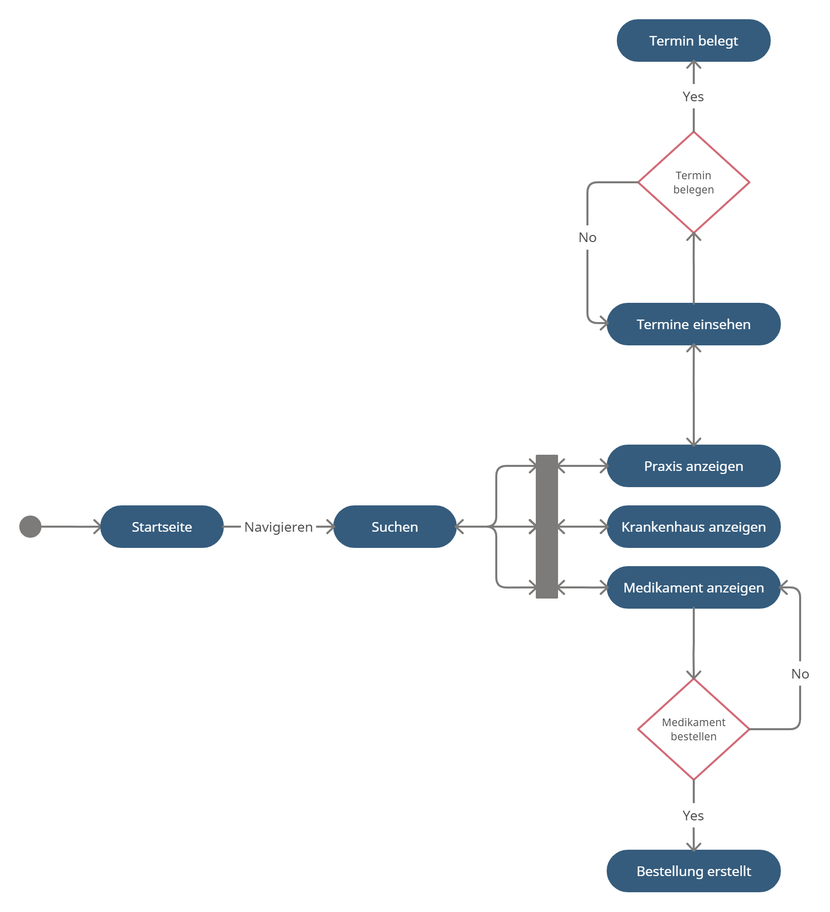

# Gesundheitsportal

### **Autor:** Leon-Maurice Leenders

 

# Überblick

Das Ziel des Gesundheitsportal ist die Digitalisierung von Praxen, Krankenhäusern und Medikamenten auf einer zentralen Seite.
Die Benutzer haben die Möglichkeit nach Praxen, Krankenhäuser und Medikamente zu suchen. Zudem gibt es die Möglichkeit die Suche mit einem
Filter einzugrenzen (z.B. Kategorie, Fachbereich, Mitarbeiter, Öffnungszeiten), um das Suchergebnis zu verringern. Ein Benutzer kann 
alle Krankenhäuser der Stadt überblicken und in der detalliert Ansicht alle wichtigen Informationen erhalten. Bei Bedarf kann ein Benutzer im Portal
Medikamente bestellen, diese werden in einer Bestellung direkt an den Benutzer versendet. Eine Praxis beinhaltet mehrere Termine, für die man sich
einschreiben kann, sofern diese frei sind. Die Praxis hat die Möglichkeit ihre Termine zu verwalten und spezifische Termine freizugeben oder akzeptieren.

 

# Funktionale Anforderungen

## Definition der Akteure

| **Akteur** | **Definition** | 
| :--------- | :------------- | 
| Benutzer | Angemeldeter Nutzer mit Berechtigungen für alle grundlegenden Funktionnen |
| Praxis | Erweitert die Benutzerrolle mit Privilegien zur Verwaltung der zugehörigen Praxis  |

 

## Use-Case Diagramme

### Benutzer und Praxis:

 
g

# User-Stories

| **Name** | **In meiner Rolle als**... | ...**möchte ich**... | ..., **so dass**... | **Erfüllt, wenn**... | **Priorität** |
|:-----|:----------:|:-------------------|:-------------|:---------|:----------------|
| Praxis registrieren | Benutzer | Praxis registrieren | Praxis für jeden Nutzer sichtbar ist | Datensatz in Datenbank eingefügt | Muss |
| Praxis anmelden | Benutzer | Praxis anmelden | Praxis verwalten werden kann | Authentifizierung erfolgreich | Muss |
| Suchen | Benutzer | Krankenhäuser, Praxen und Medikamente suchen | Alle Inhalte angezeigt werden | Datensätze zurückgegeben werden | Muss |
| Krankenhaus anzeigen | Benutzer | Spezifisches Krankenhaus einsehen | Spezifische Inhalte sichtbar sind | Datensatz zurückgegeben wird | Muss |
| Praxis anzeigen | Benutzer | Spezifische Praxis einsehen  | Spezifische Inhalte sichtbar sind | Datensatz zurückgegeben wird | Muss |
| Medikament anzeigen | Benutzer | Spezifisches Medikament einsehen | Spezifische Inhalte sichtbar sind | Datensatz zurückgegeben wird | Muss |
| Termin belegen | Benutzer | Termin bei Praxen belegen | Termin wird Benutzer zugewiesen | Datensatz in Datenbank eingefügt | Muss |
| Medikament bestellen | Benutzer | Medikament | Medikament an Benutzer versendet wird | Datensatz in Datenbank eingefügt | Muss |
| Termine einsehen | Praxis |Termine der Praxis einsehen | Alle Termin verwaltet werden können | Datensätze zurückgegeben werden | Muss |
| Termin freigeben | Praxis | Termin freigeben | Termin wird Benutzer nicht zugewiesen | Datensatz in Datenbank entfernt | Muss |
| Termin akzeptieren | Praxis | Termin akzeptieren | Termin wird von der Praxis akzeptiert | Datensatz in Datenbank eingefügt | Muss |

 

# Graphische Benutzerschnittstelle

## Authentifizier-Seite

 

## Such-Seite

 

## Krankenhaus-Seite

 

## Medikament-Seite

 

## Praxis-Seite

 

## Praxisverwaltung-Seite

 

# Datenmodell 

 

# Abläufe

# Schnittstellen

## Rest-API

| **route** |  **Type** | **Consumes** | **Params** | **Produces** |
| :------ | :----- | :----- | :----- | :----- |
| /clinic | GET | nothing | none | clinic list
| /clinic/:id | GET | nothing | clinic_id | clinic data
| /clinic | POST | title, street, house, phone, opening, closing, owner_id | none | new clinic
| /clinic/:id | DELETE | nothing | clinic_id | deletes clinic
| /clinic/:id | PUT | title, street, house, phone, opening, closing, owner_id | clinic_id | changes clinic

 

| **route** |  **Type** | **Consumes** | **Params** | **Produces** |
| :------ | :----- | :----- | :----- | :----- |
| /medicine | GET | nothing | none | medicine list
| /medicine/:id | GET | nothing | medicine_id | medicine data
| /medicine | POST | title, content, pharmacy_duty, effect | none | new medicine
| /medicine | DELETE | nothing | medicine_id | deletes medicine
| /medicine | PUT | title, content, pharmacy_duty, effect | medicine_id | changes medicine

 

| **route** |  **Type** | **Consumes** | **Params** | **Produces** |
| :------ | :----- | :----- | :----- | :----- |
| /order | GET | nothing | none | order list
| /order/:id | GET | nothing | order_id | order data
| /order | POST | order_date, medicine_list | none | new order
| /order | DELETE | nothing | order_id | deletes order

 

| **route** |  **Type** | **Consumes** | **Params** | **Produces** |
| :------ | :----- | :----- | :----- | :----- |
| /appointment/citizen | GET | nothing | none | appointment from citizen list
| /appointment/clinic/:id | GET | nothing | clinic_id | appointment from clinic data 
| /appointment | POST | date, clinic_id, citizen_id | none | new appointment
| /appointment/:id | DELETE | nothing | appointment_id | deletes appointment

## Events

| **Name** | **Payload** | 
| :------ | :----- | 
| order created | order data |
| appointment accepted | appointment data |

## Dependencies

| **Service** | **Funktion** |
| :------ | :----- | 
| Authentication Middleware | authMiddleware() |

# Technische Umsetzung

## Softwarearchitektur

- Darstellung von Softwarebausteinen (Module, Schichten, Komponenten)

Hier stellen Sie die Verteilung der Softwarebausteine auf die Rechnerknoten dar. Das ist die Softwarearchitektur. Zum Beispiel Javascript-Software auf dem Client und Java-Software auf dem Server. In der Regel wird die Software dabei sowohl auf dem Client als auch auf dem Server in Schichten dargestellt.

* Server
  * Web-Schicht
    * HTTP
    * NestJs with Express Routing
  * Logik-Schicht
    * NodeJs
    * Prisma
  * Persistenz-Schicht
    * MySQL-Datenbank

* Client
  * View-Schicht
    * HTML
    * CSS
  * Logik-Schicht
    * Javascript
  * Kommunikation-Schicht
    * HTTP

## Fehlerbehandlung 

| **ID** | **Fehler** |
| :------ | :----- | 
| 400 | Bad Request |
| 401 | Unauthorized |
| 403 | Forbidden |
| 404 | Not Found |
| 500 | Internal Server Error |

## Verwendete Technologien

* Frontend: Javascript, React
* Backend: Typescript, NestJs
* Datenbank: MySQL
