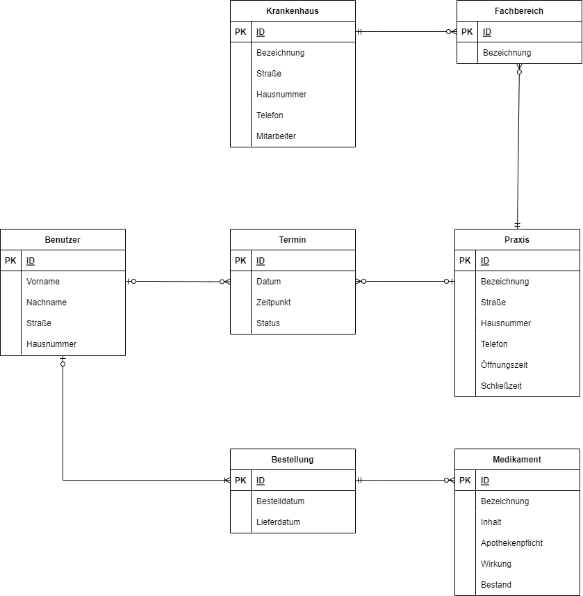

# Gesundheitsportal

### **Autor:** Leon-Maurice Leenders

 

# Überblick

Das Ziel des Gesundheitsportal ist die Digitalisierung von Praxen, Krankenhäusern und Medikamenten auf einer zentralen Seite.
Die Benutzer haben die Möglichkeit nach Praxen, Krankenhäuser und Medikamente zu suchen. Zudem gibt es die Möglichkeit die Suche mit einem
Filter einzugrenzen (z.B. Kategorie, Fachbereich, Mitarbeiter, Öffnungszeiten), um das Suchergebnis zu verringern. Ein Benutzer kann 
alle Krankenhäuser der Stadt überblicken und in der detalliert Ansicht alle wichtigen Informationen erhalten. Bei Bedarf kann ein Benutzer im Portal
Medikamente bestellen, diese werden in einer Bestellung direkt an den Benutzer versendet. Eine Praxis beinhaltet mehrere Termine, für die man sich
einschreiben kann, sofern diese frei sind. Die Praxis hat die Möglichkeit ihre Termine zu verwalten und spezifische Termine freizugeben oder akzeptieren.

 

# Funktionale Anforderungen

## Definition der Akteure

| **Akteur** | **Definition** | 
| :--------- | :------------- | 
| Benutzer | Angemeldeter Nutzer mit Berechtigungen für alle grundlegenden Funktionnen |
| Praxis | Erweitert die Benutzerrolle mit Privilegien zur Verwaltung der zugehörigen Praxis  |

 

## Use-Case Diagramme

### Benutzer und Praxis:

 

# User-Stories

| **Name** | **In meiner Rolle als**... | ...**möchte ich**... | ..., **so dass**... | **Erfüllt, wenn**... | **Priorität** |
|:-----|:----------:|:-------------------|:-------------|:---------|:----------------|
| Praxis registrieren | Benutzer | Praxis registrieren | Praxis für jeden Nutzer sichtbar ist | Datensatz in Datenbank eingefügt | Muss |
| Praxis anmelden | Benutzer | Praxis anmelden | Praxis verwalten werden kann | Authentifizierung erfolgreich | Muss |
| Suchen | Benutzer | Krankenhäuser, Praxen und Medikamente suchen | Alle Inhalte angezeigt werden | Datensätze zurückgegeben werden | Muss |
| Krankenhaus anzeigen | Benutzer | Spezifisches Krankenhaus einsehen | Spezifische Inhalte sichtbar sind | Datensatz zurückgegeben wird | Muss |
| Praxis anzeigen | Benutzer | Spezifische Praxis einsehen  | Spezifische Inhalte sichtbar sind | Datensatz zurückgegeben wird | Muss |
| Medikament anzeigen | Benutzer | Spezifisches Medikament einsehen | Spezifische Inhalte sichtbar sind | Datensatz zurückgegeben wird | Muss |
| Termin belegen | Benutzer | Termin bei Praxen belegen | Termin wird Benutzer zugewiesen | Datensatz in Datenbank eingefügt | Muss |
| Medikament bestellen | Benutzer | Medikament | Medikament an Benutzer versendet wird | Datensatz in Datenbank eingefügt | Muss |
| Termine einsehen | Praxis |Termine der Praxis einsehen | Alle Termin verwaltet werden können | Datensätze zurückgegeben werden | Muss |
| Termin freigeben | Praxis | Termin freigeben | Termin wird Benutzer nicht zugewiesen | Datensatz in Datenbank entfernt | Muss |
| Termin akzeptieren | Praxis | Termin akzeptieren | Termin wird von der Praxis akzeptiert | Datensatz in Datenbank eingefügt | Muss |

 

# Graphische Benutzerschnittstelle

## Authentifizier-Seite

 

## Such-Seite

 

## Krankenhaus-Seite

 

## Medikament-Seite

 

## Praxis-Seite

 

## Praxisverwaltung-Seite

 

# Datenmodell 

 

# Abläufe

- Aktivitätsdiagramm für den Ablauf sämtlicher Use Cases
- Aktivitätsdiagramme für relevante Use Cases
- Aktivitätsdiagramm mit Swimlanes sind in der Regel hilfreich 
  für die Darstellung der Interaktion von Akteuren der Use Cases / User Stories
- Abläufe der Kommunikation von Rechnerknoten (z.B. Client/Server)
  in einem Sequenz- oder Aktivitätsdiagramm darstellen
- Modellieren Sie des weiteren die Diagramme, die für das (eigene) Verständnis des
  Softwaresystems hilfreich sind. 

# Schnittstellen

- Schnittstellenbeschreibung (API), z.B. mit OpenAPI 
- Auflistung der nach außen sichtbaren Schnittstelle des Microservices. Über welche Schnittstelle kann z.B. der Client den Server erreichen?
- In Event-gesteuerten Systemen ebenfalls die Definition der Ereignisse und deren Attribute
- Aufteilen in Commands, Events, Queries
* Abhängigkeiten: Liste mit Kommunikationsabhängigkeiten zu anderen Microservices

## URL

http://smart.city/microservices/customer

## Commands

**Synchronous**

| **Name** | **Parameter** | **Resultat** |
| :------ | :----- | :------ |
| createCustomer() | int id | int id |
| deleteOrder() | int id | int id |

**Asynchronous**

| **Name** | **Parameter** | **Resultat** |
| :------ | :----- | :------ |
| createContract() | int id | int id |
| changeContract() | int id | - |

## Events

**Customer event channel**

| **Name** | **Payload** | 
| :------ | :----- | 
| Customer Authorized | int id |
| Customer Deleted | int id |

**Contract event channel**

| **Name** | **Payload** | 
| :------ | :----- | 
| Contract Received | int id |
| Contract Deleted | int id |

## Queries

| **Name** | **Parameter** | **Resultat** |
| :------ | :----- | :------ |
| getContracts() | - | Contract [] list |
| getContract() | int id | Contract c |

## Dependencies

### RPC

| **Service** | **Funktion** |
| :------ | :----- | 
| Authorization Service | authenticateUser() |
| Hospital Service | blockDate() |

#### Event-Subscriptions

| **Service** | **Funktion** |
| :------ | :----- | 
| Cinema channel | CancelFilmCreatedEvent |
| Customer reply channel | CreateCustomerEvent |

# Technische Umsetzung

## Softwarearchitektur

- Darstellung von Softwarebausteinen (Module, Schichten, Komponenten)

Hier stellen Sie die Verteilung der Softwarebausteine auf die Rechnerknoten dar. Das ist die Softwarearchitektur. Zum Beispiel Javascript-Software auf dem Client und Java-Software auf dem Server. In der Regel wird die Software dabei sowohl auf dem Client als auch auf dem Server in Schichten dargestellt.

* Server
  * Web-Schicht
  * Logik-Schicht
  * Persistenz-Schicht

* Client
  * View-Schicht
  * Logik-Schicht
  * Kommunikation-Schicht

Die Abhängigkeit ist bei diesen Schichten immer unidirektional von "oben" nach "unten". Die Softwarearchitektur aus Kapitel "Softwarearchitektur" ist demnach detaillierter als die Systemübersicht aus dem Kapitel "Systemübersicht". Die Schichten können entweder als Ganzes als ein Softwarebaustein angesehen werden. In der Regel werden die Schichten aber noch weiter detailliert und in Softwarebausteine aufgeteilt. 

## Entwurf

- Detaillierte UML-Diagramme für relevante Softwarebausteine

## Fehlerbehandlung 

* Mögliche Fehler / Exceptions auflisten
* Fehlercodes / IDs sind hilfreich
* Nicht nur Fehler technischer Art ("Datenbankserver nicht erreichbar") definieren, sondern auch fachliche Fehler wie "Kunde nicht gefunden", "Nachricht wurde bereits gelöscht" o.ä. sind relevant. 

## Validierung

* Relevante (Integrations)-Testfälle, die aus den Use Cases abgeleitet werden können
* Testfälle für 
  - Datenmodell
  - API
  - User Interface
* Fokussieren Sie mehr auf Integrationstestfälle als auf Unittests
* Es bietet sich an, die IDs der Use Cases / User Stories mit den Testfällen zu verbinden,
  so dass erkennbar ist, ob Sie alle Use Cases getestet haben.

## Verwendete Technologien

* Frontend: Javascript, React
* Backend: Javascript, ExpressJS
* Datenbank: MySQL
