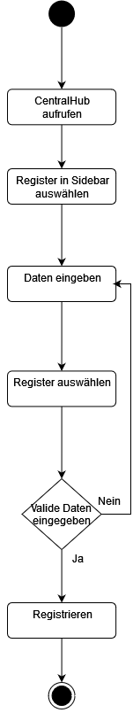
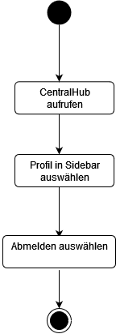
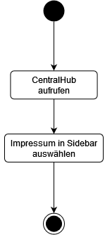

# CentralHub

**Autor:** Justin Kühnel, Patrick Mayer, Finn Amini Kaveh

## Überblick

- Der Hub zielt darauf ab, als zentrale Schnittstelle für den Bürger zu dienen, über welche dieser alle vorhandenen Microservices erreichen und mit diesen interagieren kann. Dabei sollen die Microservices in den Hub eingebettet werden und somit indirekt Teil der Anwendung sein. Zudem stellt er die Funktionalität für die Registrierung und den Login bereit und umfasst ein Impressum. 

## Funktionale Anforderungen
**Akteure**
| **Akteur** | **Definition** |
| :--------- | :----- |
| Bürger | Angemeldeter Bürger mit grundlegenden Berechtigungen |
| Gast | Nicht angemeldeter Besucher mit eingeschränkten Berechtigungen |

- Bürger und Gäste müssen in der Lage sein, zwischen den einzelnen Microservices zu navigieren
- Bürger und Gäste müssen in der Lage sein, einen Microservice auszuwählen, um mit diesem zu interagieren
- Gäste müssen in der Lage sein, sich in der Anwendung zu registrieren
- Es muss möglich sein, dass sich Bürger mit ihren Anmeldedaten in der Anwendung anmelden können
- Die Anwendung muss rechtliche- sowie Kontaktinformationen bereitstellen

 

 

## Anforderungen im Detail

### User Stories

| **Name**| **In meiner Rolle als**...|   ...**möchte ich**...   | ..., **so dass**... | **Erfüllt, wenn**... | **Priorität**   |
|:-----|:----------:|:-------------------|:-------------|:---------|:----------------|
| Registrieren |Gast| mich registrieren können|ich Zugriff auf weitere Funktionen erhalte und meine Daten gespeichert werden können| ein Gast sich registrieren kann | Must |
| Login  Bürger| mich einloggen können|Zugriff auf meine Daten erhalte und weitere Funktionalitäten nutzen kann| ein Bürger sich einloggen kann | Must |
| Logout  Bürger| mich ausloggen können|es nicht länger möglich ist über das aktuelle Gerät Daten auszulesen oder zu ändern | ein Bürger sich ausloggen kann | Must |
| Zugriff Microservices  Bürger, Gast| auf die verschiedenen Microservices zugreifen können|ich mit dem jeweiligen Microservice interagieren kann| der Zugriff auf die Microservices möglich ist | Must |
| Impressum  Bürger, Gast| rechtliche- und Kontaktinformationen einsehen können|ich diesbezüglich bescheid weiß| wenn eine Art Impressum bereit gestellt wird | Must |

### Misuse Stories

| **Name**| **In meiner Rolle als**...|   ...**möchte ich**...   | ..., **so dass**... | **Erfüllt, wenn**... | **Priorität**   |
|:-----|:----------:|:-------------------|:-------------|:---------|:----------------|
| Doppelte E-mail Adresse |Gast| eine E-Mail Adresse bei der Registrierung mehrfach verwenden können|ich mir leichter merken kann, was ich für eine E-Mail Adresse verwendet habe| Bei erneuter Verwendung einer E-Mail Adresse wird eine Fehlermeldung angezeigt | Must |
| Zu einfaches Passwort |Gast| bei der Registrierung sehr einfache und kurze Passwörter verwenden können|ich mir diese besser merken kann| es eine mindestanforderung an das Passwort gibt | Must |
| Account Diebstahl |Gast, Bürger| mich problemlos mit fremden Accounts anmelden können|ich Aktionen in deren Namen durchführen und ihre Daten auslesen kann| dies durch ein Passwort oder sonstige Sicherheitsmaßnahmen verhindert wird | Must |

## Graphische Bürgerschnittstelle

- GUI-Mockups 
  - Als Gast
    
    - Startseite
    - User Story: Zugriff Microservices

    
    
    
    - Impressum 
    - User Story: Impressum

    
    
    
    - Loginseite 
    - User Story: Login

    
    
    
    - Registierungsseite
    - User Story: Registrieren

    
    
    
    - Startseite mit eingeklappter Navbar
    - User Storie: Zugriff Microservices

    
    
  - Als angemeldeter Bürger
    - Startseite 

    
    - Impressum

    

## Datenmodell 

 

## Abläufe

 

  Aktivität Einloggen      |  Aktivität Registrieren      |  Aktivität Abmelden      |  Aktivität Impressum aufrufen      |  Aktivität Microservice aufrufen
:-------------------------:|:-------------------------:|:-------------------------:|:-------------------------:|:-------------------------:
  |    |    |    |  

## Schnittstellen

### Externe Schnittstellen
- **/**:  Navigiert zu der Homepage
- **/login**: Navigiert zur Login- / Registrierungseite
- **/impressum**: Navigiert zur Impressumsseite

### Interne Schnittstellen
- **GET (' /api/citizens')**: Daten für alle Citizens
- **GET ('/api/citizens/:id')**: Daten für einen Citizen
- **POST (' /api/citizens')**: Erstellen eines neuen Citizens
- **PUT (' /api/citizens/:id')**: Updaten eines bestehenden Citizens
- **DELETE (' /api/citizens/:id')**: Löschen eines Citizens

**Beispiel:**

### URL

http://smart.city

### Events

**Citizen event channel**

| **Name** | **Payload** | 
| :------ | :----- | 
| Citizen Created | Object citizen |
| Citizen Authorized | int id |

### Dependencies

#### Event-Subscriptions

| **Service** | **Funktion** |
| :------ | :----- | 
| Citizen channel | CitizenUpdatedEvent |
| Citizen channel | CitizenDeletedEvent |

## Technische Umsetzung

### Softwarearchitektur

* Server
  * Web-Schicht: JavaScript
  * Logik-Schicht: Node.js, Express.js
  * Persistenz-Schicht: MySQL Datenbank

Da im Frontend mit dem Javascript Framework React gearbeitet werden soll, welches einen sehr modularen Ansatz verfolgt, bei dem einzelne Komponenten mindestens die View-Schicht und die Logik-Schicht miteinander vereinen, kann hier keine klare Trennung zwischen den einzelnen Schichten definiert werden. In der Theorie setzen sich die Schichten jedoch wie folgt zusammen.

* Client
  * View-Schicht: JSX (HTML), CSS
  * Logik-Schicht: JavaScript
  * Kommunikation-Schicht: JavaScript, JSON

### Fehlerbehandlung 

* Technische Fehler
  * Fehler: 404 Not Found -> Eine Datei, ein Verzeichnis oder eine Schnittstelle konnte nicht gefunden werden.
  * Fehler: 400 Bad Request -> Es wurden fehlerhafte Informationen an die API übergeben
  * SQL-Error -> Ein Fehler in der Datenbank ist aufgetreten
  * Timeout Error: -> Zeitüberschreitungsfehler

* Fachliche Fehler
  * Bei der Registrierung eines Bürgers
    * Es existiert bereits ein Bürger mit dieser E-Mail Adresse.
    * Es existiert bereits ein Bürger mit dieser HandyNummer.
    * Es müssen alle Felder ausgefüllt werden.
    * Die angegebene E-Mail-Adresse muss dem genannten Format entsprechen.
    * Die angegebene Handynummer muss dem genannten Format entsprechen.
    * Ungültiges Passwort! Das Passwort muss das folgende Format haben.
    * Im Falle eines Backendfehlers: Etwas ist schiefgelaufen! Bitte versuchen Sie es später erneut! 

  * Bei dem Login eines Bürgers
    * Die eingegebenen Bürgerdaten sind falsch.
    * Sie haben sich zu oft in zu kurzer Zeit versucht einzuloggen.
    * Alle Felder müssen ausgefüllt werden.
    * Im Falle eines Backendfehlers: Etwas ist schiefgelaufen! Bitte versuchen Sie es später erneut!

### Validierung

| **Testfalltyp** | **Beschreibung** | **Testschritt** | **Erwartetes Ergebnis** | **Status** |
| :------ | :----- | :----- | :----- | :----- | 
| Sicherheit | Passwort muss den Anforderungen entsprechen | Ein neues Passwort wird erstellt, welches den Anforderungen entspricht | Das Passwort wird akzeptiert |Erfolgreich oder durchgefallen |
| Funktionalität | Die Links zu den Microservices funktionieren | Alle Verlinkungen werden getestet | Statuscode 200 |Erfolgreich oder durchgefallen |
| Sicherheit | E-Mail Adressen dürfen nicht mehrfach verwendet werden | Eingabe einer bereits genutzten E-Mail Adresse | Eine Fehlermeldung wird angezeigt |Erfolgreich oder durchgefallen |
| Funktionalität, Benutzerfreundlichkeit | Alle Felder müssen bei der Registrierung ausgefüllt werden | Formular wird abgeschickt ohne, dass alle Felder ausgefüllt wurden | Eine Fehlermeldung wird angezeigt |Erfolgreich oder durchgefallen |
| Sicherheit | E-Mail Adresse muss den Anforderungen entsprechen | Eingabe einer E-Mail Adresse, die nicht den Anforderungen entspricht | Eine Fehlermeldung wird angezeigt |Erfolgreich oder durchgefallen |

Es muss grundsätzlich in allen Schnittstellen validiert werden. Dies gilt besonders für die Schnittstellen, die dem Benutzer zugänglich sind.
Bei POST Befehlen müssen die Daten auf ihre Richtigkeit validiert werden und jegliche Benutzerinputs müssen Datenbanksicher gemacht werden. Das bedeutet, dass sie sowohl dahingehend entwertet werden müssen, dass sie keine Gefahr für die Datenbank an sich darstellen (Stichwort SQL Injections) als auch für andere Benutzer (Cross-site-scripting).
Ebenso muss bei allen Zugriffen geprüft werden, ob der Benutzer über die benötigten Rechte verfügt, die Aktion auszuführen. Gleiches gilt in diesem Fall für die GET Befehle.

### Verwendete Technologien

* Frontend
  - HTML5, CSS3, Javascript - React.js
* Backend
  - Node.js, Express.js
* Datenbank
  - MySQL
