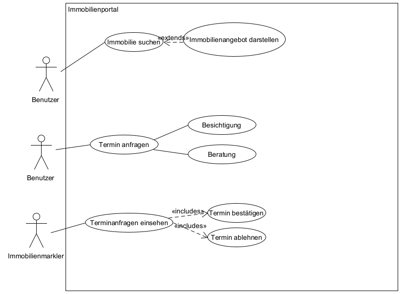
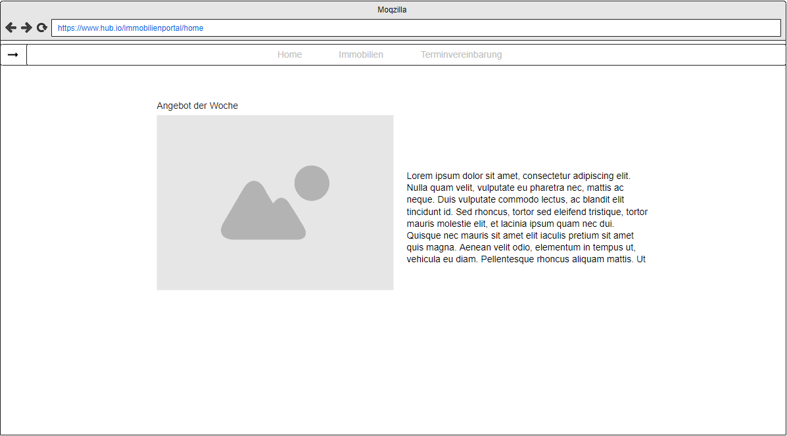
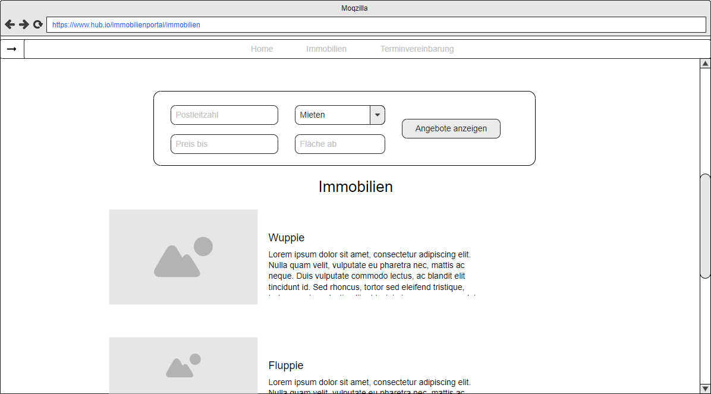
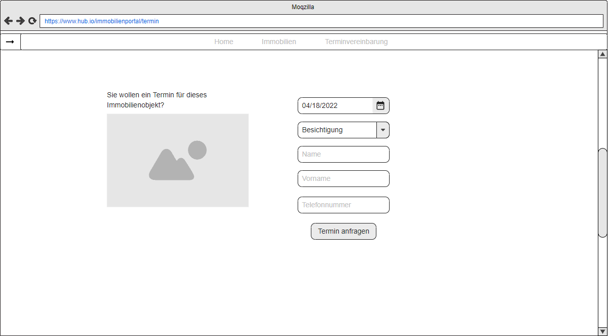
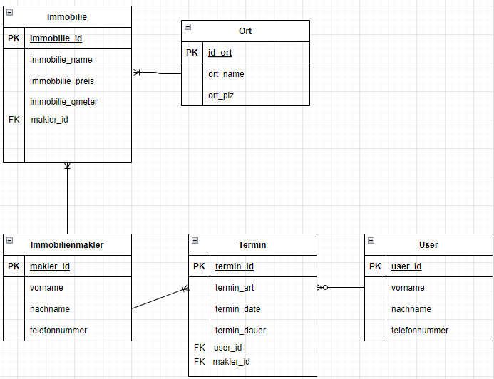
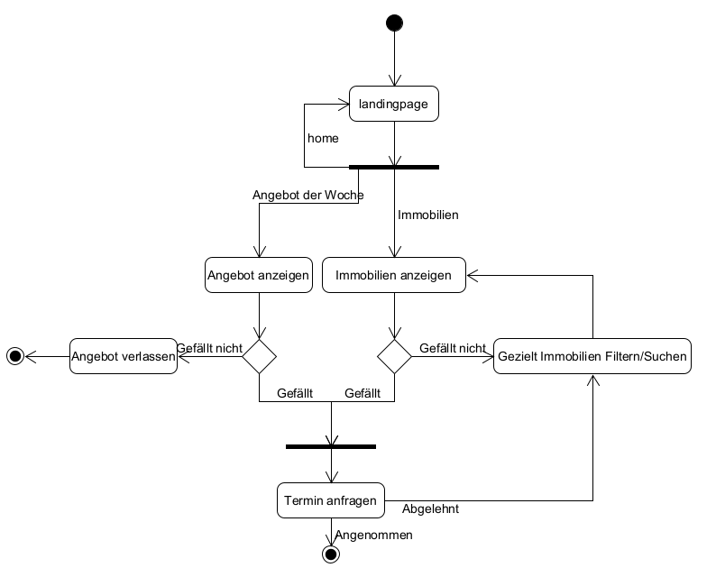

# Immobilienportal

**Autor:** Fabian Pechta

## Überblick

- Der Microservice "Immobilienportal" soll Benutzern es ermöglichen, Immobilien zu suchen und Termine, wie zum Beispiel eine Wohnungsbesichtigung, digital buchen zu können.

## Funktionale Anforderungen

* Definition der Akteure

| **Akteure** | **Definition** |
| :------ | :----- |
| Benutzer | Benutzer mit grundlegenden Berechtigungen  |
| Immobilienmakler | Benutzer mit grundlegenden Berechtigungen |

* Use-Case Diagramme

## Anforderungen im Detail

**User Stories**

| **Als** | **möchte ich** | **so dass** | **Akzeptanz** |
| :------ | :----- | :------ | :-------- |
| Benutzer | authentifiziert werden | ich Termine und andere Handlungen in meinem Namen ausführen kann | Benutzername wird angezeigt |
| Benutzer | nach Immobilien suchen können | ich gute Angebote finden kann | Immobiliensuche liefert Ergebnisse |
| Benutzer | Immobilien anbieten können | andere Benutzer das Angebot bekommen | Immobilie hochgeladen und wird angezeigt |
| Benutzer | Bilder von den Immobilien sehen können | ich mir das Immobilienobjekt besser vorstellen kann | Immobilien besitzen Bilder |
| Benutzer | über gute Angebote informiert werden | ich am meisten Geld sparen kann | Meldung über Preisnachlässe / gute Deals |
| Immobilienmakler | Termine von Benutzern einsehen können | ich diese annehmen oder ablehnen kann | Ansicht von Terminanfragen |

- Misuse-Stories beinhalten Dinge, wie, dass Benutzer einfach alles mögliche eingeben können, wie zum Beispiel eine Immobilie, die garnicht existiert.
  Daher soll nach einreichen einer Immobilie geprüft werden, ob sich es hierbei um ein Legitimes Objekt handelt.

## Graphische Benutzerschnittstelle

## Mockup Home

## Mockup Immobilien

## Mockup Termin

## Datenmodell 

  

## Abläufe

  

## Technische Umsetzung

### Verwendete Technologien

- Verwendete Technologien (Programmiersprachen, Frameworks, etc.)

* Frontend
  - HTML5, CSS und ReactJS
* Backend
  - Fast API (Python)
* Datenbank
  - MySQL
