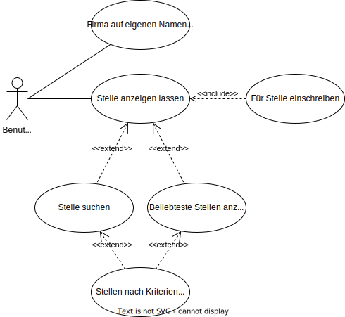
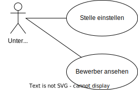
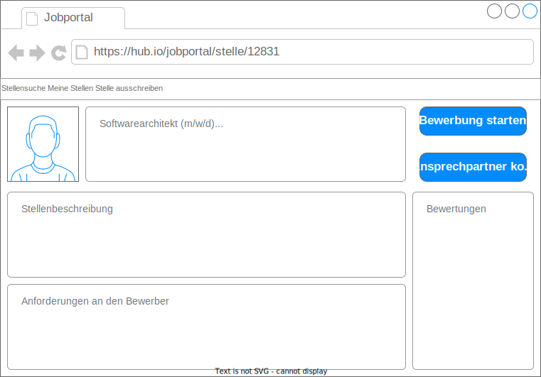
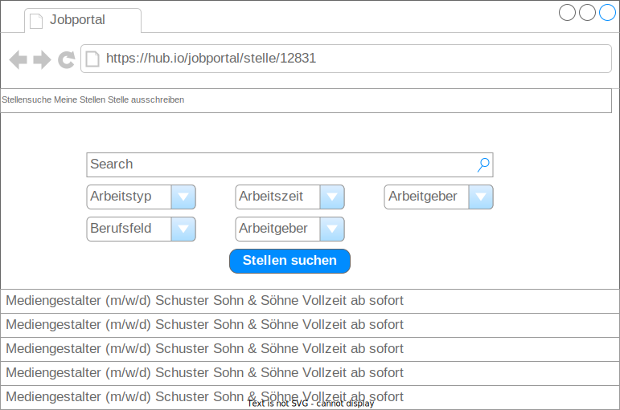
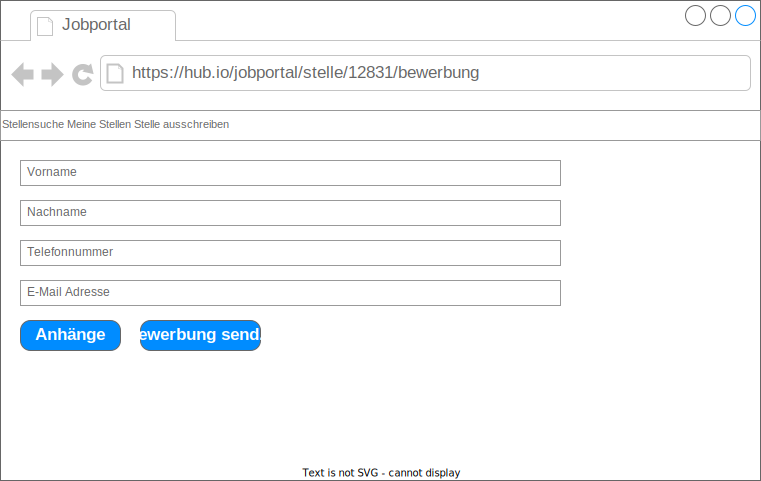

# Jobportal

**Autor:** Clemens Vogtländer

## Überblick

Der Microservice Jobportal befasst sich mit der Ausschreibung und Suche von Praktikumsplätzen, Ausbildungsplätzen, Minijobs sowie Teilzeit und Vollzeitstellen, welche im Nachfolgenden als Arbeitsstellen oder Stellen bezeichnet werden.

Sobald ein Bürger von der Hauptseite aus auf den Microservice zugreift, kann er entweder nach Stellen suchen, oder eine Firma registrieren um Stellen auszuschreiben.

Falls der Bürger nach einer Ausbildungsstelle suchen möchte, kann er nach Berufsbezeichnungen sowie Firmennamen suchen. Außerdem kann er die Suche nach gewünschter Stelle sowie nach gewünschtem Berufsfeld, wie z.B. Informatik, Physik, Maschinenbau Filtern.

Falls eine Stelle gefunden wurde, kann sich ein Bürger für diese Stelle registrieren, um so Kontakt zum Unternehmen aufzubauen.
Sobald ein Bürger sich für die Stelle registriert hat, wird sie nichtmehr auf der Hauptseite gelistet.

Falls ein Benutzer bereits eine Firma besitzt und Stellen ausschreiben möchte, kann er eine Firma auf seinen Namen registrieren und Stellen ausschreiben.

## Funktionale Anforderungen

### Akteure im Microservice

Folgende Akteure interagieren mit dem Microservice:

* **Benutzer** der Standard Benutzer der den Microservice benutzt, um nach Stellen zu suchen.
* **Unternehmer** ein Bürger der gleichzeitig ein Unternehmen im Microservice repräsentiert und Stellen ausschreiben kann.

### Use Case Diagramme

#### Benutzer

#### Unternehmer

## Anforderungen im Detail

### User Stories

| **ID** | **Priorität** | **Als** | **möchte ich** | **so dass ich** | **Akzeptanz** |
| :----- | :------------ | :------ | :------------- | :---------- | :------------ |
| Stellenanzeige | muss | Bürger | stellen anzeigen lassen | nach passenden Stellen schauen kann | Stellenanzeige funktioniert |
| Stellensuche | muss | Bürger | nach Stellen suchen können | bessere Ergebnisse erhalte | Suche funktioniert |
Stelleneinschreibung | muss | Bürger | mich für eine Stelle einschreiben können | die Stelle bekomme | Stelleneinschreibung funktioniert |
Firma registrieren | soll | Bürger | eine Firma auf meinen Namen registrieren | Stellen ausschreiben kann | Firmenregistrierung funktioniert |
Stellenausschreibung | soll | Unternehmer | eine Stellenausschreibung für meine Firma vornehmen | neue Bewerber finde | Stellenausschreibung funktioniert |
Bewerber ansehen | soll | Unternehmer | Bewerber für meine Stellenausschreibungen ansehen | Bewerber filtern kann | Bewerberansicht funktioniert |
| Stellenranking | kann | Bürger | die beliebtesten Stellen sehen können | die besten Stellen zu sehen | Stellenranking funktioniert |
| Stellen filtern | kann | Bürger | meine Suche und das Ranking filtern können | genauere Angebote sehe | Filtern nach Stellen funktioniert |
Stellenrückmeldung | kann | Bürger | den Status meiner Bewerbungen einsehen | weiß ob ich genommen werde | Stellenrückmeldung funktioniert |
Chat-Funktion | kann | Bürger | Bei Rückfragen mit dem Ansprechpartner der Firma schreiben | mögliche Probleme zu beseitigen | Chat-Funktion zwischen Benutzer und Firma funktioniert

## Grafische Benutzerschnittstelle

### Stellenanzeige

### Stellensuche

### Stelleneinschreibung

## Datenmodell

## Abläufe

- Aktivitätsdiagramm für den Ablauf sämtlicher Use Cases
- Aktivitätsdiagramme für relevante Use Cases
- Aktivitätsdiagramm mit Swimlanes sind in der Regel hilfreich 
  für die Darstellung der Interaktion von Akteuren der Use Cases / User Stories
- Abläufe der Kommunikation von Rechnerknoten (z.B. Client/Server)
  in einem Sequenz- oder Aktivitätsdiagramm darstellen
- Modellieren Sie des weiteren die Diagramme, die für das (eigene) Verständnis des
  Softwaresystems hilfreich sind. 

## Schnittstellen

- Schnittstellenbeschreibung (API), z.B. mit OpenAPI 
- Auflistung der nach außen sichtbaren Schnittstelle des Microservices. Über welche Schnittstelle kann z.B. der Client den Server erreichen?
- In Event-gesteuerten Systemen ebenfalls die Definition der Ereignisse und deren Attribute
- Aufteilen in Commands, Events, Queries
* Abhängigkeiten: Liste mit Kommunikationsabhängigkeiten zu anderen Microservices

**Beispiel:**

### URL

http://smart.city/microservices/customer

### Commands

**Synchronous**

| **Name** | **Parameter** | **Resultat** |
| :------ | :----- | :------ |
| createCustomer() | int id | int id |
| deleteOrder() | int id | int id |

**Asynchronous**

| **Name** | **Parameter** | **Resultat** |
| :------ | :----- | :------ |
| createContract() | int id | int id |
| changeContract() | int id | - |

### Events

**Customer event channel**

| **Name** | **Payload** | 
| :------ | :----- | 
| Customer Authorized | int id |
| Customer Deleted | int id |

**Contract event channel**

| **Name** | **Payload** | 
| :------ | :----- | 
| Contract Received | int id |
| Contract Deleted | int id |

### Queries

| **Name** | **Parameter** | **Resultat** |
| :------ | :----- | :------ |
| getContracts() | - | Contract [] list |
| getContract() | int id | Contract c |

### Dependencies

#### RPC

| **Service** | **Funktion** |
| :------ | :----- | 
| Authorization Service | authenticateUser() |
| Hospital Service | blockDate() |

#### Event-Subscriptions

| **Service** | **Funktion** |
| :------ | :----- | 
| Cinema channel | CancelFilmCreatedEvent |
| Customer reply channel | CreateCustomerEvent |

## Technische Umsetzung

### Softwarearchitektur

- Darstellung von Softwarebausteinen (Module, Schichten, Komponenten)

Hier stellen Sie die Verteilung der Softwarebausteine auf die Rechnerknoten dar. Das ist die Softwarearchitektur. Zum Beispiel Javascript-Software auf dem Client und Java-Software auf dem Server. In der Regel wird die Software dabei sowohl auf dem Client als auch auf dem Server in Schichten dargestellt.

* Server
  * Web-Schicht
  * Logik-Schicht
  * Persistenz-Schicht

* Client
  * View-Schicht
  * Logik-Schicht
  * Kommunikation-Schicht

Die Abhängigkeit ist bei diesen Schichten immer unidirektional von "oben" nach "unten". Die Softwarearchitektur aus Kapitel "Softwarearchitektur" ist demnach detaillierter als die Systemübersicht aus dem Kapitel "Systemübersicht". Die Schichten können entweder als Ganzes als ein Softwarebaustein angesehen werden. In der Regel werden die Schichten aber noch weiter detailliert und in Softwarebausteine aufgeteilt. 

### Entwurf

- Detaillierte UML-Diagramme für relevante Softwarebausteine

### Fehlerbehandlung 

* Mögliche Fehler / Exceptions auflisten
* Fehlercodes / IDs sind hilfreich
* Nicht nur Fehler technischer Art ("Datenbankserver nicht erreichbar") definieren, sondern auch fachliche Fehler wie "Kunde nicht gefunden", "Nachricht wurde bereits gelöscht" o.ä. sind relevant. 

### Validierung

* Relevante (Integrations)-Testfälle, die aus den Use Cases abgeleitet werden können
* Testfälle für 
  - Datenmodell
  - API
  - User Interface
* Fokussieren Sie mehr auf Integrationstestfälle als auf Unittests
* Es bietet sich an, die IDs der Use Cases / User Stories mit den Testfällen zu verbinden,
  so dass erkennbar ist, ob Sie alle Use Cases getestet haben.

### Verwendete Technologien

- Verwendete Technologien (Programmiersprachen, Frameworks, etc.)

* Frontend
* Backend
* Datenbank
