# Jobportal

**Autor:** Clemens Vogtländer

## Überblick

Der Microservice Jobportal befasst sich mit der Ausschreibung und Suche von Praktikumsplätzen, Ausbildungsplätzen, Minijobs sowie Teilzeit und Vollzeitstellen, welche im Nachfolgenden als Arbeitsstellen oder Stellen bezeichnet werden.

Sobald ein Bürger von der Hauptseite aus auf den Microservice zugreift, kann er entweder nach Stellen suchen, oder eine Firma registrieren um Stellen auszuschreiben.

Falls der Bürger nach einer Ausbildungsstelle suchen möchte, kann er nach Berufsbezeichnungen sowie Firmennamen suchen. Außerdem kann er die Suche nach gewünschter Stelle sowie nach gewünschtem Berufsfeld, wie z.B. Informatik, Physik, Maschinenbau Filtern.

Falls eine Stelle gefunden wurde, kann sich ein Bürger für diese Stelle registrieren, um so Kontakt zum Unternehmen aufzubauen.
Sobald ein Bürger sich für die Stelle registriert hat, wird sie nichtmehr auf der Hauptseite gelistet.

Falls ein Benutzer bereits eine Firma besitzt und Stellen ausschreiben möchte, kann er eine Firma auf seinen Namen registrieren und Stellen ausschreiben.

## Funktionale Anforderungen

### Definition der Akteure

| **Akteur** | **Beschreibung** | 
| :--------- | :------------- |
| Benutzer | angemeldeter Benutzer, der von der Hauptseite aus auf den Microservice zugreift|
| Unternehmer | ein Bürger der ein Unternehmen angemeldet hat und erweiterte Berechtigungen zum einstellen von Jobs oder dem einsehen von Bewerbungen besitzt

### Use Case Diagramme

#### Benutzer:

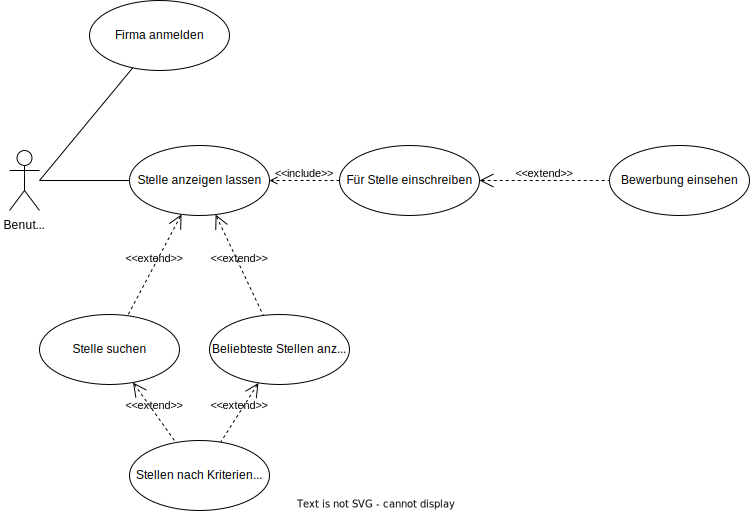

#### Unternehmer:

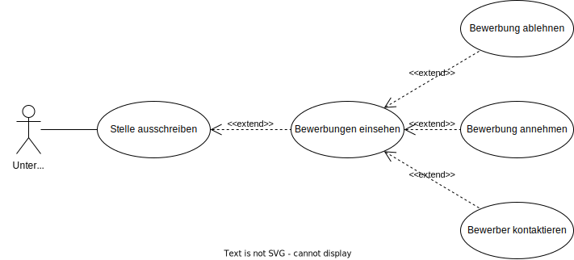

## Anforderungen im Detail

### User Stories: Benutzer

| **ID** | **Priorität** | **Als** | **möchte ich** | **so dass ich** | **Akzeptanz** |
| :----- | :------------ | :------ | :------------- | :---------- | :------------ |
| Stellenanzeige | muss | Benutzer | stellen im Microservice anzeigen lassen | nach passenden Stellen suchen kann | Stellenanzeige implementiert
| Stelleneinschreibung | muss | Benutzer | mich für eine Stelle einschreiben | die Stelle möglicherweise bekomme | Stelleneinschreibung implementiert
| Firma registrieren | muss | Benutzer | eine Firma auf meinen Namen registrieren | selber Stellen ausstellen kann | Firmenregistrierung funktioniert |
| Stelle suchen | soll | Benutzer | nach Firmen und Berufen suchen können | nach bekannten Firmen ausschau halten kann | Stellensuche implementiert
| Stellen filtern | soll | Benutzer | meine Suchkriterien nach verschiedenen Aspekten filtern können | präzisere Ergebnisse erhalte | Suchfilter implementiert |
| Bewerbungen einsehen | soll | Benutzer | meine abgeschickten Bewerbungen einsehen können | Rückmeldungen der Firmen sehe | Bewerbungseinsicht implementiert |
| Stellenranking | gering | Benutzer | die beliebtesten Stellen ansehen können | möglicherweise Lukrative Stellen wahrnehmen kann | Stellenranking implementiert |
| Stellenausschreibung | muss | Unternehmer | Stellen für meine Firma ausschreiben können | Bewerber finde | Stellenausschreibung implementiert
| Bewerbungen einsehen | soll | Unternehmer | Bewerbungen von Interessenten ansehen | sie ablehnen oder annehmen kann | Einsehen für Bewerbungen implementiert
| Rückmeldung | kann | Unternehmer | Bewerbungen annehmen oder ablehnen können | die Leute in meiner Firma einstelle | Rückmeldung für Bewerbungen funktioniert
| Kontaktaufnahme | gering | Unternehmer | bei möglichen Fragen oder Unklarheiten den Bewerber kontaktieren können | Unklarheiten kläre | Kontaktaufnahme funktioniert

## Graphische Benutzerschnittstelle

### Mockups

#### **Stellenanzeige**

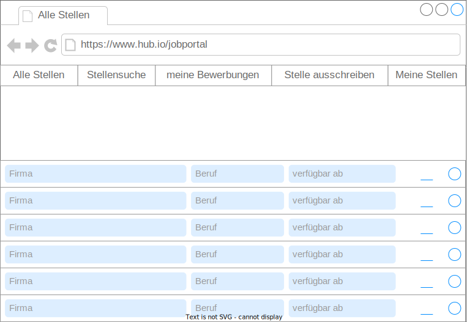

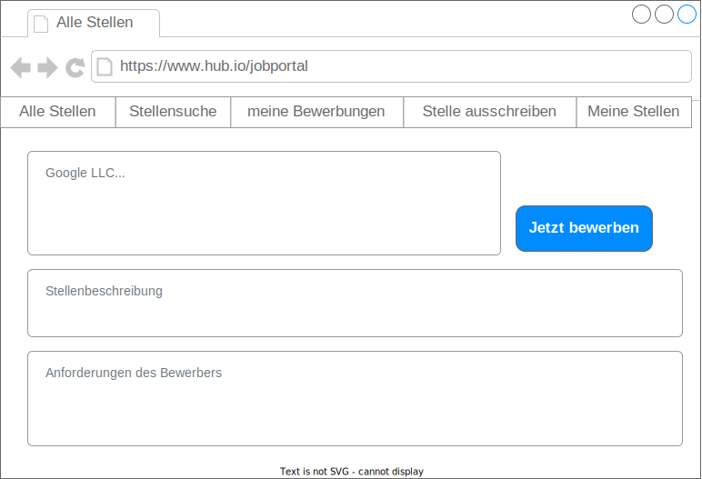

#### **Stellensuche**

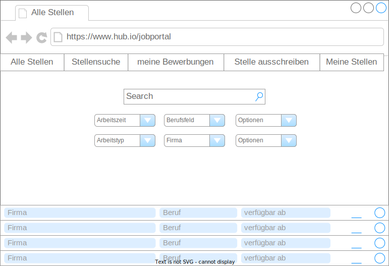

#### **Meine Bewerbungen**

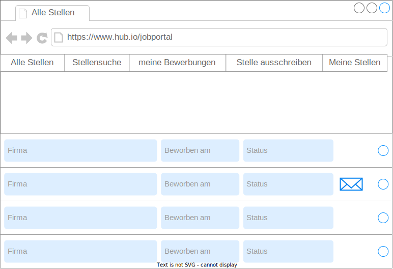

#### **Firmenregistrierung**

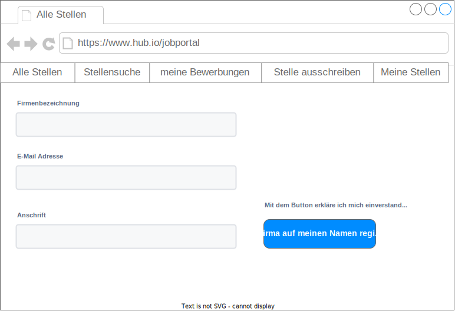

#### **Stelle ausschreiben**

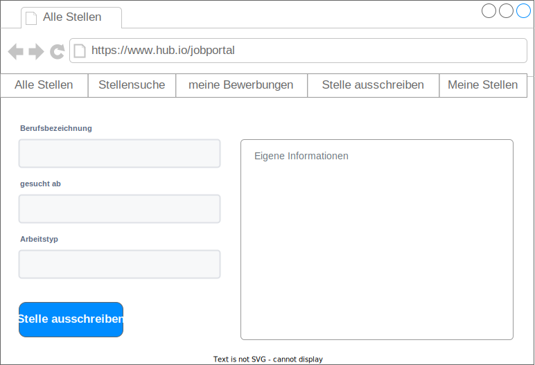

#### **Meine ausgeschriebenen Stellen**

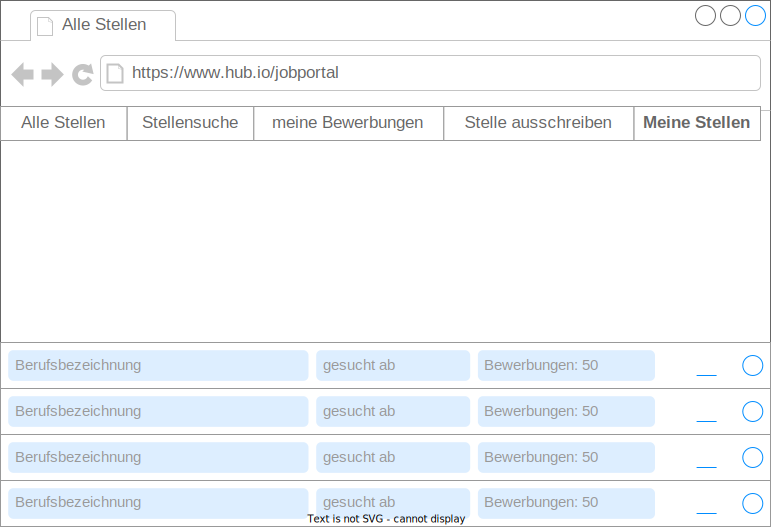

#### **Bewerber ansehen**

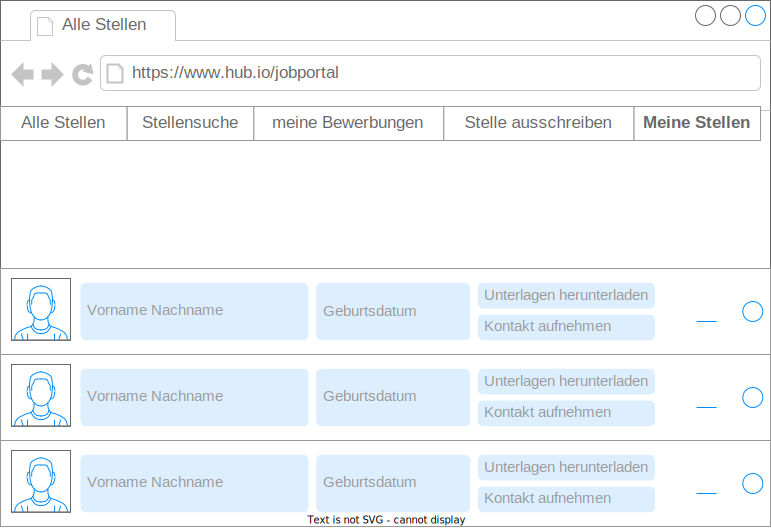

## Datenmodel

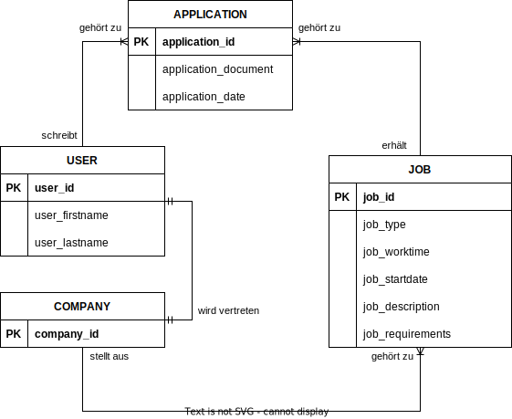

## Schnittstellen

### URL

http://smart.city/microservices/jobportal

### Events

#### Eigene Events

| **Name** | **Payload** | 
| :------ | :----- | 
| NewJobOffer | Job job |

#### Event-Abhängigkeiten

| **Service** | **Funktion** | **Beschreibung**|
| :------ | :----- | :-------- |
| Mainhub | CitizenUpdated | Falls sich eine userID ändert, die mit Bewerbungen oder einer Firma in verbindung steht, muss sich auch der Eintrag im Microservice ändern

# Technische Umsetzung

## Softwarearchitektur
* Server
  * Web-Schicht
  * Logik-Schicht
  * Persistenz-Schicht

* Client
  * View-Schicht
  * Logik-Schicht
  * Kommunikation-Schicht
  
## Verwendete Technologien
 * Frontend
   * Javascript
      * React Framework
 * Backend
   * Javascript
     * Express Framework
 * Datenbank
   * MySQL
