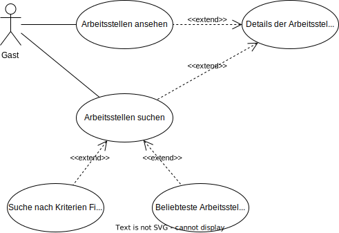

# Jobportal

**Autor:** Clemens Vogtländer

## Überblick

Der Microservice Jobportal befasst sich mit der Ausschreibung, Suche und Bewerbung für _Praktikumsplätze, Ausbildungsplätze, Minijobs, sowie Teilzeit- und Vollzeitstellen_, welche in der folgenden Dokumentation als _Arbeitsstellen_ bezeichnet werden.

Der Microservice kann sowohl von Bürgern von SmartCity, als auch von Gästen die sich nicht im Hautportal angemeldet haben mit eingeschränkten Features benutzt werden.

Nichtangemeldete Bürger haben die Möglichkeit sich ausgeschriebene Stellen anzusehen und danach zu suchen, falls man sich anmeldet steht einem sowohl die Bewerbung bei Stellen, als auch die Möglichkeit eine eigene Stelle über eine Firma auszuschreiben offen.

## Funktionale Anforderungen

### Definition der Akteure

| **Akteur**  | **Beschreibung** |
| :---------  | :--------------- |
| _Gast_        | Benutzer, der ohne eine Anmeldung die Hauptseite benutzt |
| _Benutzer_    | im Hauptportal Authentifizierter Benutzer, welcher über erweiterte Features verfügt.
| _Unternehmer_ | im Hauptportal Authentifizierter Benutzer, welcher eine Firma auf seinen Account registriert hat und über Features zur Firmenausschreibung verfügt. |

### Use-Case Diagramme

#### 1. _Gast_

#### 2. _Benutzer_

#### 3. _Unternehmer_

## Anforderungen im Detail

### User Stories

| **ID** | **Akteur** | **möchte ich** | **so dass ich** | **Erfüllt, wenn** | **Priorität** |
| :----- | :--------- | :------------- | :-------------- | :---------------- | ------------: |
| #1 | Gast | Arbeitsstellen im Microservice anzeigen lassen | passende Arbeitsstellen für mich finden kann | Stellen werden angezeigt | muss
| #2 | Gast | Details einer Arbeitsstelle ansehen | mir die genauen Stellendaten ansehen kann | Stellendetails können per klick  angezeigt werden | muss |
| #3 | Gast | Arbeitsstellen suchen | bessere Arbeitsstellen finde | Stellensuche funktioniert | muss |
| #4 | Gast | Meine Suche nach Suchkritierien Filtern | noch genauere Ergebnisse bekomme | verschiedene Suchkriterien möglich | muss |
| #5 | Gast | ein Ranking der beliebtesten Stellen angezeigt bekommen | die lukrativsten Stellen sehe | "Beliebteste Stellen" Seite funktioniert | optional |
|  
| #6 | Benutzer | mich bei Arbeitsstellen bewerben | die Chance auf eine Arbeit bekomme | Button "Bewerbung" auf Stellendetailseite funktioniert | muss |
| #7 | Benutzer | meine abgegeben Bewerbungen ansehen | eine Übersicht über alle meine Bewerbungen habe| "Meine Stellen" Seite funktioniert | muss
| #8 | Benutzer | Bewerbungsstatus einsehen | sehen, ob Firmen mich annehmen oder ablehnen | Bewerbungsstatus wird auf "Meine Stellen" Seite angezeigt| muss |
| #9 | Benutzer | eine Firma registrieren| eigene Stellen ausschreiben kann | Firmenregistrierung funktioniert | muss |
|  
| #10 | Unternehmer | eine Arbeitsstelle für mein Unternehmen ausschreiben | neue Arbeitnehmer finde | Stellenausschreibung funktioniert | muss |
| #11 | Unternehmer | Eine Übersicht über alle meine ausgeschriebenen Stellen sehen | eine Übersicht über alle Stellen habe | Schnittstelle "Meine Stellen" funktioniert | muss |
| #12 | Unternehmer | eingegangene Bewerbungen für meine Stellen angezeigt bekommen | Interessierte Bewerber sehe | Schnittstelle "Bewerbungen" funktioniert | muss |
| #13 | Unternehmer | Bewerbungen beantworten | Bewerbern eine Rückmeldung gebe | Beantworten von Bewerbungen funktioniert | muss |
| #14 | Unternehmer | Ausgeschriebene Stellen löschen | sie nichtmehr sehe | Verschiedene Stellen löschen funktioniert | soll |
| #15 | Unternehmer | meine Firmen löschen | sie nichtmehr auf der Seite finden kann | Firmen löschen funktioniert | soll |

**Legende**:

| Name  | Beschreibung |
| :---- | -----------: |
| muss  | Muss auf jeden Fall zur Releaseversion (v1) implementiert und funktionsfähig sein. |
| soll  | Kein Hauptfeature, soll aber bis zur Releaseversion (v1) implementiert sein. |
| optional | Geringe Priorität, wird implementiert falls nach den Hauptfeatures noch Zeit bis zum Release übrig ist. | 

## Graphische Benutzerschnittstelle

### Mockups

#### **Stellenanzeige**  
Stories: #1, #2

#### **Stellensuche**  
Stories: #3, #4, #5, #6

#### **Meine Bewerbungen**  
tories: #7, #8

#### **Firmenregistrierung**  
Stories: #9

#### **Stelle ausschreiben**  
Stories: #10

#### **Meine ausgeschriebenen Stellen**  
Stories: #11

#### **Bewerber ansehen**  
Stories: #12, #13

## Datenmodell
Datenmodell der API in der dritten Normalform:

## Schnittstellen

### URL
http://smartcity.w-mi.de/jobportal

### Schnittstellen

#### **Wichtige Externe Schnittstellen**
| Schnittstelle | Beschreibung |
| :------------ | -----------: |
| /             | Startseite welche eine Beschreibung des Microservices enthält. |
| /stellen      | Liste aller Stellen.
| /stellensuche | Stellensuche. |
| /meine-bewerbungen | Übersicht über eigene Bewerbungen. |
| /meine-firmen | Übersicht über eigene Firmen. |
| /stellenausschreibung | Formular zur Stellenausschreibung. |

#### **Wichtige Interne Schnittstellen (API)**

| Schnittstelle | Methode | Beschreibung |
| :------------ | :------ | -----------: |
| /auth         | POST    | Schnittstelle für Authentifizierung über JWT Token. |
| /citizen      | GET, POST, PUT, DELETE    | Controller für Zugriff auf Daten des angemeldeten Benutzers. |
| /jobs         | GET, POST, PUT, DELETE    | Controller für Zugriff auf Arbeitsstellen |
| /companies    | GET, POST, PUT, DELETE    | Controller für Zugriff auf Firmendaten |
| /applications | GET, POST, PUT, DELETE    | Controller für Zugriff auf Bewerbungen |

### Events

#### **Gesendete Events**

| RoutingKey | Payload | Beschreibung |
| :--------- | :------ | -----------: |
| service.hello | - | Event zur Benachrichtung für den Hauptservice, dass ein Microservice gestartet ist. Als Antwort wird ein _service.world_ mit dem JWT Secret als inhalt erwartet. |

#### **Empfangene Events**

| RoutingKey | Payload | Beschreibung |
| :--------- | :------ | -----------: |
| service.world | Secret Key | Event zum Empfang des JWT Secrets. Wird vom Hauptservice ausgesendet, sobald ein Microservice _service.hello_ gesendet hat. |

## Technische Umsetzung

### Softwarearchitektur

* Server
  * Web-Schicht
    * JavaScript
      * Express.js Framework
  * Logik-Schicht
      * Node.js
        * Sequelize ORM Framework
  * Persistenz-Schicht
    * MySQL Server
      * Datenbank

* Client
  * View-Schicht
    * HTML
    * CSS
  * Logik-Schicht
    * JavaScript
      * React.js Framework
  * Kommunikation-Schicht
    * HTTP Request/Response

### Fehlerbehandlung 

#### API

| Fehlercode | Name | Beschreibung |
| :--------- | :--- | -----------: |
| 400 | Bad Request | Fehlende Parameter in der Anfrage |
| 401 | Unauthorized | Nicht angemeldet |
| 403 | Forbidden | Keine Authentifizierung, da JWT Token  Signatur ungültig. |
| 404 | Not Found | Seite nicht gefunden. |
| 405 | Method not Allowed | Zugriff auf Route mittels einer falschen HTTP Methode |

### Verwendete Technologien

* Frontend
  * JavaScript
    * React.js
      * Material UI
* Backend
  * JavaScript
    * Express.js
    * Sequelize ORM
* Datenbank
  * MySQL