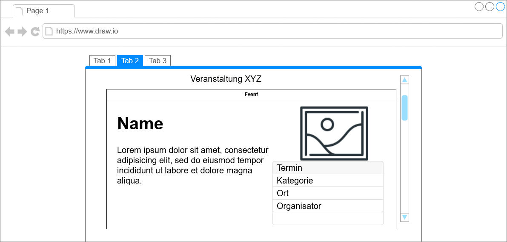

# Kulturportal

**Autor:** Nico Hübner

## Überblick

- Der Service Kulturportal soll eine Vielzahl an Kultur-, Restaurant-, und Sportangeboten in der Statt darlegen. Ein zentraler Ort an dem sich Informationen für eine Vielzahl an Freizeitangeboten und Veranstaltungen finden lassen. Für die Veranstaltungen (z.B. Konzerte, Feste, Verkaufsoffene Sonntage, Tag der offenen Tür etc.) sollte neben einer kurzen Beschreibung der Termin, Ort und die angesprochene Zielgruppe vermerkt sein. Es sollten Restaurants zu finden sein, die neben einer kurzen Beschreibung bei sich einen Tisch reservieren lassen. Zudem gibt es eine Liste mit Sportvereinen und Sportanbietern (Fitnessstudios, öffentliche Sportplätze). Diese können hier effektiv für sich werben und über sich informieren (Trainingszeiten, Mitgliedsbeiträge etc.)

## Funktionale Anforderungen

* Definition der Akteure:
    ○ User -> Benutzer, die Informationen über Events, Sportangebote und Restaurants einholen können. Können auch Reservierungen tätigen.
		○ Creator von Events -> Veranstalter von Events.
		○ Vereine -> Ein Verein bzw. Sportanbieter, kann auch Creator eines Events sein.
		○ Restaurants -> Lokal, kann auch Creator eines Events sein.
    

* Use-Case Diagramm:

## Anforderungen im Detail

### User Stories

| Als              | Möchte Ich                                                                          | So dass                                                         | Aktzeptanz                                                               |
|------------------|-------------------------------------------------------------------------------------|-----------------------------------------------------------------|--------------------------------------------------------------------------|
| Benutzer         | Veranstaltungen angezeigt bekommen                                                  | Ich über sie Informiert bin und an ihnen Teilnehmen kann        | Veranstaltungen werden aufgelistet (evtl. in einem Kalender)             |
| Benutzer         | Sportangebote in meiner Stadt einsehen können                                       | Ich über sie informiert bin und an ihnen Teilnehmen kann        | Vereine und Sportangebote werden in einem "Hub" angezeigt                |
| Benutzer         | Restaurants in meiner Stadt angezeigt bekommen                                      | Ich über sie informiert bin                                     | Eine Liste mit allen Restaurants wird angezeigt                          |
| Benutzer         | Bei einem Restaurant meiner Wahl eine Reservierung tätigen, jedoch Zeit X im Voraus | Ich dort einen Platz reservieren kann, für eine definierte Zeit | Das Restaurant erfährt von meiner Reservierung                           |
| Veranstalter     | Veranstaltungen erstellen                                                           | Sie mit Informationen für alle Nutzer sichtbar sind             | Veranstaltungen können  in einem definierten Format hinzugefügt werden   |
| Veranstalter     | Veranstaltungen bearbeiten                                                          | Informationen (Ort, Zeit etc.) verändert werden können          | Veranstaltungen können bearbeitet/verändert werden                       |
| Veranstalter     | Veranstaltungen canceln                                                             | Veranstaltungen canceln und dies ggf. mit einer Begründung      | Veranstaltungen können gelöscht werden, eine Erklärung wird hinzugefügt  |
| Sporteinrichtung | Über ihren Verein informieren/werben                                                | Benutzer die Einrichtung in einem Hub angezeigt bekommen        | Sporteinrichtungen können in einem definierten Format hinzugefügt werden |
| Sporteinrichtung | Informationen über ihre Einrichtung aktualisieren                                   | Informationen aktuell gehalten werden                           | Sporteinrichtungen können bearbeitet/verändert werden                    |
| Sporteinrichtung | Schließen                                                                           | Das der Verein nicht mehr zu finden ist                         | Sporteinrichtungen können gelöscht werden                                |
| Restaurant       | Über ihr Lokal informieren/werben                                                   | Benutzer bekommen Lokale in einem Hub angezeigt                 | Lokale können in einem definierten Format hinzugefügt werden             |
| Restaurant       | Ihr Lokal aktualisieren                                                             | Informationen aktuell gehalten werden                           | Lokale können bearbeitet/verändert werden                                |
| Restaurant       | Schließen können                                                                    | Das der Lokale nicht mehr zu finden ist                         | Lokale können gelöscht werden                                            |
| Restaurant       | Reservierungen entgegen nehmen                                                      | Sie mit diesen Arbeiten/Planen können                           | Restaurants bekommen stündlich eine Liste mit Reservierungen             |

## Graphische Benutzerschnittstelle

### Gui Mock Ups für den User

Veranstaltungskalender

Eine detailierte Veranstaltung

Liste der Restaurants

Ein detailiertes Restaurant

Liste der Sportangebote

Ein detailiertes Sportangebot

## Datenmodell 

- Begriffe im Glossar darstellen
- Modellierung des physikalischen Datenmodells 
  - RDBMS: ER-Diagramm bzw. Dokumentenorientiert: JSON-Schema

## Abläufe

- Aktivitätsdiagramm für den Ablauf sämtlicher Use Cases

## Schnittstellen

### URL

http://smart.city/microservices/kulturportal

### Events

**Customer event channel**

| **Name** | **Payload** | 
| :------ | :----- | 
| Customer Authorized | int id |
| Customer Deleted | int id |

## Technische Umsetzung

### Softwarearchitektur

* Server
  * Web-Schicht
  * Logik-Schicht
  * Persistenz-Schicht

* Client
  * View-Schicht
  * Logik-Schicht
  * Kommunikation-Schicht

### Fehlerbehandlung 

* Mögliche Fehler / Exceptions auflisten
* Fehlercodes / IDs sind hilfreich
* Nicht nur Fehler technischer Art ("Datenbankserver nicht erreichbar") definieren, sondern auch fachliche Fehler wie "Kunde nicht gefunden", "Nachricht wurde bereits gelöscht" o.ä. sind relevant. 

### Verwendete Technologien

- Verwendete Technologien (Programmiersprachen, Frameworks, etc.)

* Frontend -> Python, Django Framework
* Backend -> Python, Django Framework
* Datenbank -> MySQL
