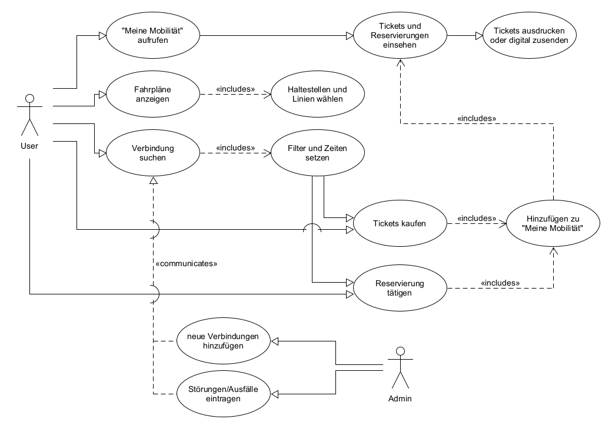
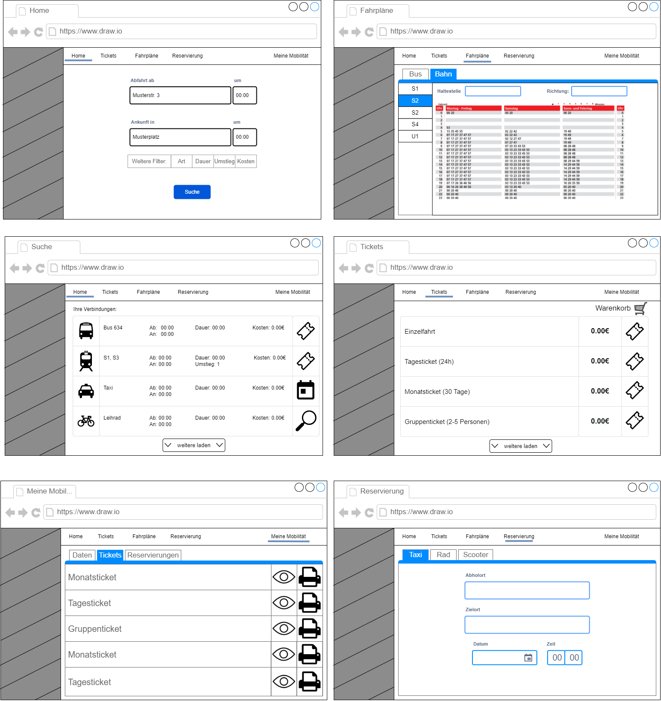
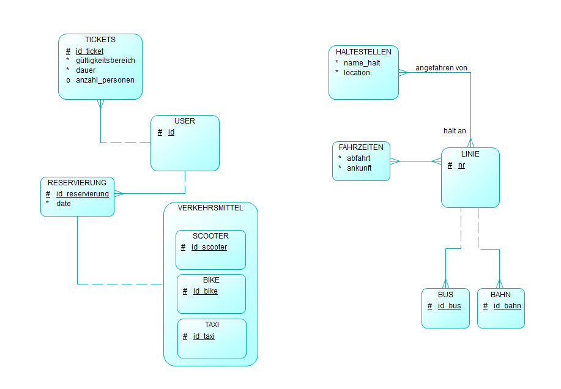

# Mobilitätshub

**Autor:** Dennis Edler

## Überblick

Das Ziel ist es eine Übersichtsseite für den (öffentlichen) Personen-Nahverkehr zu bieten. Diese Seite soll Abfahrt- und Ankunftszeiten alles Bus- und Bahnverbindungen beinhalten, sowie eine Übersicht über sonstige Verkehrsmittel wie Taxen, Mieträder, E-Scooter die zur Verfügung stehen. Es sollen mögliche Verbindungen anhand des Start- und Zielortes angezeigt werden, wobei die Möglichkeit besteht diese anhand von Filtern einzuschränken (z.B. Zeitaufwand, Verkehrsmittel, Kosten, etc.). Innerhalb des Portals soll die Möglichkeit bestehen Tickets für den ÖPNV zu erwerben oder direkt eine Reservierung für Taxen, Fahrräder oder E-Scooter vorzunehmen. Bei Störungen oder Ausfällen sollen Personen benachrichtigt und mit Alternativen versorgt werden.

Die Möglichkeiten der Vernetzungen sind zu allen anderen Services gegeben. Man könnte anhand von Reservierungen und Terminen bei Ämtern, Restaurants oder Veranstaltungen direkt passende Verbindungen anzeigen um rechtzeitig dort zu sein. Wenn große Veranstaltungen stattfinden könnte man die Verkehrsmittel entsprechend auf einer Route aufstocken um das zunehmende Transportationsaufkommen besser zu verteilen. Mit dem Service der Polizei könnte eine Kommunikation stattfinden so dass bei Einsätzen/Strassensperrungen eine Verzögerung anzeigt oder Umleitungen vorgeschlagen werden.

## Funktionale Anforderungen

## User-Stories

| **Als** | **möchte ich** | **so dass** | **Akzeptanz** |
| :------ | :----- | :------ | :-------- |
| User | eine Übersicht über die möglichen Verkehrsmittel (Bus, Bahn, Taxi, E-Roller, ...) bekommen | ich anhand meiner Bedürfnisse entscheiden kann welches Mittel ich nutze | Mögliche Verkehrsmittel anzeigen |
| User | mir Fahrpläne des ÖPNV anzeigen lassen | ich jederzeit planen kann wie ich von A nach B komme | Anzeige von Fahrplänen |
| User | dass mir Möglichkeiten anhand der Uhrzeit und Position gegeben werden | ich in jedem Moment genau planen kann | Auswahl der Uhrzeit und Start-/Endhaltestelle |
| User | direkt im Service Fahrkarten kaufen können | um Zeit zu sparen und Voraus zu planen | Kauf von Fahrkarten |
| User | meine Fahrkarten ausdrucken oder an Mobilgeräte senden können | ich diese auch sofort verfügbar habe | Tickets werden versendet |
| User | Reservierungen für Verkehrsmittel (Wie Taxi, E-Scooter, Mietrad, ...) tätigen können | um im Voraus meine Fahrten zu planen | Reservierungen |
| User | angezeigte Verkehrsmittel und Verbindungen nach Filtern sortieren können | mir nur bevorzugte Möglichkeiten angezeigt werden | Suchfilter |
| User | bei Ausfällen oder Verspätungen Alternativen angezeigt bekommen | ich trotzdem pünktlich am Zielort ankomme | Anzeige der besten Verbindung |
| Admin | neue Routen/Verbindungen hinzufügen können | User immer die aktuellen Möglichkeiten einsehen können | Hinzufügen von Verbindungen |
| Admin | Störungen, Ausfälle, Staus, etc. eintragen können | User über diese informiert werden | Bearbeiten von Verbindungen |

## Graphische Benutzerschnittstelle

## Datenmodell 

## Abläufe

## Schnittstellen

Zur Abfrage der Daten aus der Datenbank wird eine API erstellt. Diese wird mit Prisma umgestzt, einer Library welche serverseitig Daten aus der Datenbank lesen und schreiben kann. Diese Library ist für MySQL und TypeScript ausgelegt und passt damit perfekt ins Anforderungsprofil. 

## Technische Umsetzung

### Softwarearchitektur

- Darstellung von Softwarebausteinen (Module, Schichten, Komponenten)

Hier stellen Sie die Verteilung der Softwarebausteine auf die Rechnerknoten dar. Das ist die Softwarearchitektur. Zum Beispiel Javascript-Software auf dem Client und Java-Software auf dem Server. In der Regel wird die Software dabei sowohl auf dem Client als auch auf dem Server in Schichten dargestellt.

* Server
  * Web-Schicht
  * Logik-Schicht
  * Persistenz-Schicht

* Client
  * View-Schicht
  * Logik-Schicht
  * Kommunikation-Schicht

Die Abhängigkeit ist bei diesen Schichten immer unidirektional von "oben" nach "unten". Die Softwarearchitektur aus Kapitel "Softwarearchitektur" ist demnach detaillierter als die Systemübersicht aus dem Kapitel "Systemübersicht". Die Schichten können entweder als Ganzes als ein Softwarebaustein angesehen werden. In der Regel werden die Schichten aber noch weiter detailliert und in Softwarebausteine aufgeteilt.

### Entwurf

- Detaillierte UML-Diagramme für relevante Softwarebausteine

### Fehlerbehandlung 

* Mögliche Fehler / Exceptions auflisten
* Fehlercodes / IDs sind hilfreich
* Nicht nur Fehler technischer Art ("Datenbankserver nicht erreichbar") definieren, sondern auch fachliche Fehler wie "Kunde nicht gefunden", "Nachricht wurde bereits gelöscht" o.ä. sind relevant. 

### Validierung

* Relevante (Integrations)-Testfälle, die aus den Use Cases abgeleitet werden können
* Testfälle für 
  - Datenmodell
  - API
  - User Interface
* Fokussieren Sie mehr auf Integrationstestfälle als auf Unittests
* Es bietet sich an, die IDs der Use Cases / User Stories mit den Testfällen zu verbinden,
  so dass erkennbar ist, ob Sie alle Use Cases getestet haben.

### Verwendete Technologien

- Front- und  Backend:  TypeScript
- Framework:            React.js
- Datenbank:            MySQL
