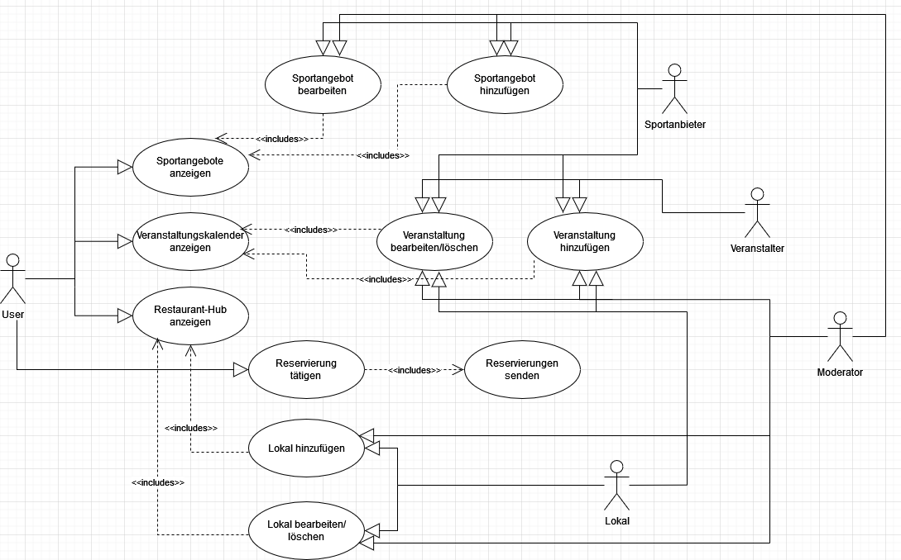

# Kulturportal

**Autor:** Nico Hübner

## Überblick

- Der Service Kulturportal soll eine Vielzahl an Kultur-, Restaurant-, und Sportangeboten in der Statt darlegen. Ein zentraler Ort an dem sich Informationen für eine Vielzahl an Freizeitangeboten und Veranstaltungen finden lassen. Für die Veranstaltungen (z.B. Konzerte, Feste, Verkaufsoffene Sonntage, Tag der offenen Tür etc.) sollte neben einer kurzen Beschreibung der Termin, Ort und die angesprochene Zielgruppe vermerkt sein. Es sollten Restaurants zu finden sein, die neben einer kurzen Beschreibung bei sich einen Tisch reservieren lassen. Zudem gibt es eine Liste mit Sportvereinen und Sportanbietern (Fitnessstudios, öffentliche Sportplätze). Diese können hier effektiv für sich werben und über sich informieren (Trainingszeiten, Mitgliedsbeiträge etc.)

## Funktionale Anforderungen

* Definition der Akteure:
    ○ User -> Benutzer
		○ Creator von Events -> Veranstalter
		○ Vereine -> müssen auch Veranstaltungen erstellen
		○ Restaurants -> müssen auch Veranstaltungen erstellen 
    ○ Moderator? Kann überall eingreifen quasi Admin

* Use-Case Diagramm:

## Anforderungen im Detail

**Als**|**Möchte ich**|**So dass **|**Akzeptanz**
:-----:|:-----:|:-----:|:-----:
Benutzer|Veranstaltungen angezeigt bekommen|Ich über sie Informiert bin und an ihnen Teilnehmen kann|Veranstaltungen werden aufgelistet (evtl. in einem Kalender)
Benutzer |Sportangebote in meiner Stadt einsehen können|Ich über sie informiert bin und an ihnen Teilnehmen kann|Vereine und Sportangebote werden in einem "Hub" angezeigt
Benutzer|Restaurants in meiner Stadt angezeigt bekommen|Ich über sie informiert bin|Eine Liste mit allen Restaurants wird angezeigt
Benutzer |Bei einem Restaurant meiner Wahl eine Reservierung tätigen, jedoch Zeit X im Voraus|Ich dort einen Platz reservieren kann, für eine definierte Zeit|Das Restaurant erfährt von meiner Reservierung
 | | | 
Veranstaltungsersteller (Creator)|Veranstaltungen erstellen|Sie mit Informationen für alle Nutzer sichtbar sind|Veranstaltungen können  in einem definierten Format hinzugefügt werden
Veranstaltungsersteller (Creator)|Veranstaltungen bearbeiten |Informationen (Ort, Zeit etc.) verändert werden können   |Veranstaltungen können bearbeitet/verändert werden
Veranstaltungsersteller (Creator)|Veranstaltungen canceln|Veranstaltungen canceln und dies ggf. mit einer Begründung|Veranstaltungen können gelöscht werden, eine Erklärung wird hinzugefügt
 | | | 
Sporteinrichtungen|Über ihren Verein informieren/werben|Benutzer die Einrichtung in einem Hub angezeigt bekommen|Sporteinrichtungen können in einem definierten Format hinzugefügt werden
Sporteinrichtungen|Informationen über ihren Dings aktualisieren|Informationen aktuell gehalten werden|Sporteinrichtungen können bearbeitet/verändert werden
Sporteinrichtungen|Können schließen|Das der Verein nicht mehr zu finden ist|Sporteinrichtungen können gelöscht werden
Restaurants |Über ihr Lokal informieren/werben |Benutzer bekommen Lokale in einem Hub angezeigt|Lokale können in einem definierten Format hinzugefügt werden 
Restaurants|Ihr Lokal aktualisieren |Informationen aktuell gehalten werden|Lokale können bearbeitet/verändert werden
Restaurants|Können schließen|Das der Lokale nicht mehr zu finden ist|Lokale können gelöscht werden
Restaurants|Können Reservierungen entgegen nehmen|Sie mit diesen Arbeiten/Planen können |Restaurants bekommen stündlich eine Liste mit Reservierungen

- Sicherheit: Misuse-Stories formulieren

**Schablone für User Stories**

| **Als** | **möchte ich** | **so dass** | **Akzeptanz** |
| :------ | :----- | :------ | :-------- |
| Wer | Was | Warum | Wann akzeptiert |

## Graphische Benutzerschnittstelle

- GUI-Mockups passend zu User Stories
- Screens mit Überschrift kennzeichnen, die im Inhaltsverzeichnis zu sehen ist
- Unter den Screens darstellen (bzw. verlinken), welche User Stories mit dem Screen abgehandelt werden
- Modellierung der Navigation zwischen den Screens der GUI-Mockups als Zustandsdiagramm
- Mockups für unterschiedliche Akteure

## Datenmodell 

- Begriffe im Glossar darstellen
- Modellierung des physikalischen Datenmodells 
  - RDBMS: ER-Diagramm bzw. Dokumentenorientiert: JSON-Schema

## Abläufe

- Aktivitätsdiagramm für den Ablauf sämtlicher Use Cases
- Aktivitätsdiagramme für relevante Use Cases
- Aktivitätsdiagramm mit Swimlanes sind in der Regel hilfreich 
  für die Darstellung der Interaktion von Akteuren der Use Cases / User Stories
- Abläufe der Kommunikation von Rechnerknoten (z.B. Client/Server)
  in einem Sequenz- oder Aktivitätsdiagramm darstellen
- Modellieren Sie des weiteren die Diagramme, die für das (eigene) Verständnis des
  Softwaresystems hilfreich sind. 

## Schnittstellen

- Schnittstellenbeschreibung (API), z.B. mit OpenAPI 
- Auflistung der nach außen sichtbaren Schnittstelle des Microservices. Über welche Schnittstelle kann z.B. der Client den Server erreichen?
- In Event-gesteuerten Systemen ebenfalls die Definition der Ereignisse und deren Attribute
- Aufteilen in Commands, Events, Queries
* Abhängigkeiten: Liste mit Kommunikationsabhängigkeiten zu anderen Microservices

**Beispiel:**

### URL

http://smart.city/microservices/customer

### Commands

**Synchronous**

| **Name** | **Parameter** | **Resultat** |
| :------ | :----- | :------ |
| createCustomer() | int id | int id |
| deleteOrder() | int id | int id |

**Asynchronous**

| **Name** | **Parameter** | **Resultat** |
| :------ | :----- | :------ |
| createContract() | int id | int id |
| changeContract() | int id | - |

### Events

**Customer event channel**

| **Name** | **Payload** | 
| :------ | :----- | 
| Customer Authorized | int id |
| Customer Deleted | int id |

**Contract event channel**

| **Name** | **Payload** | 
| :------ | :----- | 
| Contract Received | int id |
| Contract Deleted | int id |

### Queries

| **Name** | **Parameter** | **Resultat** |
| :------ | :----- | :------ |
| getContracts() | - | Contract [] list |
| getContract() | int id | Contract c |

### Dependencies

#### RPC

| **Service** | **Funktion** |
| :------ | :----- | 
| Authorization Service | authenticateUser() |
| Hospital Service | blockDate() |

#### Event-Subscriptions

| **Service** | **Funktion** |
| :------ | :----- | 
| Cinema channel | CancelFilmCreatedEvent |
| Customer reply channel | CreateCustomerEvent |

## Technische Umsetzung

### Softwarearchitektur

- Darstellung von Softwarebausteinen (Module, Schichten, Komponenten)

Hier stellen Sie die Verteilung der Softwarebausteine auf die Rechnerknoten dar. Das ist die Softwarearchitektur. Zum Beispiel Javascript-Software auf dem Client und Java-Software auf dem Server. In der Regel wird die Software dabei sowohl auf dem Client als auch auf dem Server in Schichten dargestellt.

* Server
  * Web-Schicht
  * Logik-Schicht
  * Persistenz-Schicht

* Client
  * View-Schicht
  * Logik-Schicht
  * Kommunikation-Schicht

Die Abhängigkeit ist bei diesen Schichten immer unidirektional von "oben" nach "unten". Die Softwarearchitektur aus Kapitel "Softwarearchitektur" ist demnach detaillierter als die Systemübersicht aus dem Kapitel "Systemübersicht". Die Schichten können entweder als Ganzes als ein Softwarebaustein angesehen werden. In der Regel werden die Schichten aber noch weiter detailliert und in Softwarebausteine aufgeteilt. 

### Entwurf

- Detaillierte UML-Diagramme für relevante Softwarebausteine

### Fehlerbehandlung 

* Mögliche Fehler / Exceptions auflisten
* Fehlercodes / IDs sind hilfreich
* Nicht nur Fehler technischer Art ("Datenbankserver nicht erreichbar") definieren, sondern auch fachliche Fehler wie "Kunde nicht gefunden", "Nachricht wurde bereits gelöscht" o.ä. sind relevant. 

### Validierung

* Relevante (Integrations)-Testfälle, die aus den Use Cases abgeleitet werden können
* Testfälle für 
  - Datenmodell
  - API
  - User Interface
* Fokussieren Sie mehr auf Integrationstestfälle als auf Unittests
* Es bietet sich an, die IDs der Use Cases / User Stories mit den Testfällen zu verbinden,
  so dass erkennbar ist, ob Sie alle Use Cases getestet haben.

### Verwendete Technologien

- Verwendete Technologien (Programmiersprachen, Frameworks, etc.)

* Frontend
* Backend
* Datenbank
