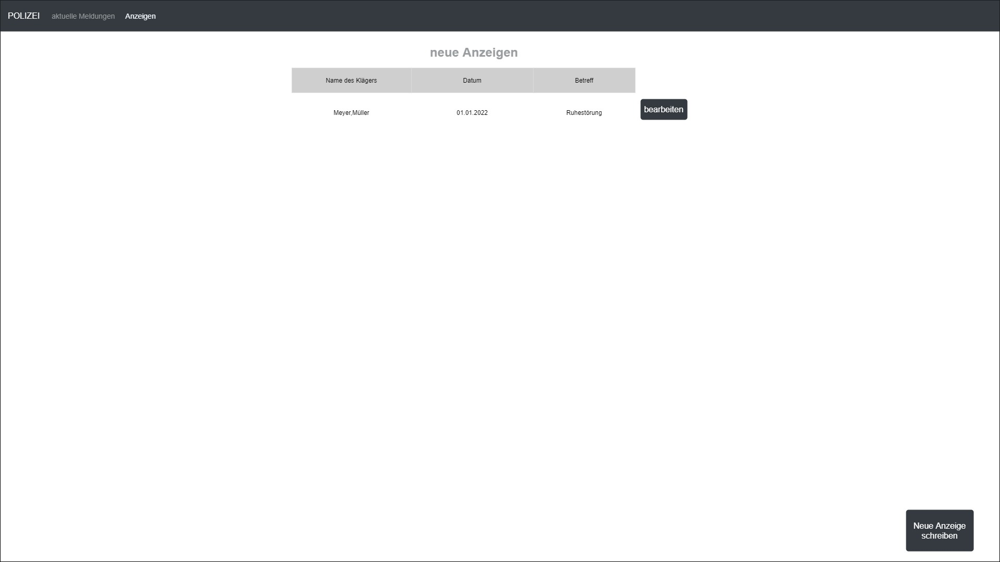

# Polizei

**Autor:** Ben-Lukas Horn

 
## Overview

Die Anwendung verleiht den beiden Akteuren, Beamten und Bürger, die Möglichkeit miteinander zu Kommunizieren.
  Ein Bürger kann folgende Funktionen verwenden:
  - aktuelle Meldungen einsehen (gesuchte Personen, Neuigkeiten, Stau- und Unfallmeldungen)
  - Stau- und Unfallmeldungen einreichen
  - Hinweise zu gesuchten Personen einreichen
  - Notrufnummern anzeigen
  - Notruf über Webseite absetzen
  - Anzeige einreichen
  
Ein Beamter kann diese Anfragen dann bearbeiten. Dafür ist ein eigenes Interface vorgesehen. Ein Beamter kann folgende Funktionen verwenden:
  - Neue Stau-und Unfallmeldungen einsehen, an- und ablehnen
  - Anzeigen bearbeiten und ebenfalls neue aufgeben können
  - Neuigkeiten verwalten
  - Notrufe über die Webseite entgegennehmen
### Aktuelle Meldungen einsehen (Bürgersicht)
Ein Bürger bekommt auf seine "Startseite" aktuelle Meldungen gezeigt. Über diese Seite kann er ebenfalls neue Meldungen beantragen und Hinweise zu gesuchten Personen abgeben
### Stau- und Unfallmeldungen einreichen
Ein Bürger kann über ein Formular eine Stau- oder Unfallmeldung einreichen.
Bei dieser kann er den Ort oder Umkreis und die Uhrzeit angeben.
Dazu können wahlweise auch Dateien wie z.B. Bilder angefügt werden.
### Hinweise zu gesuchten Personen einreichen
Ein Bürger hat die Möglichkeit weitere Hinweise zu einer gesuchten Person einzureichen.
In diesem Formular kann er die Art des Hinweises, das Funddatum und eine ausführliche Beschreibung des Hinweises eintragen.
Dazu gibt es die Möglichkeit Bilder und/oder Dateien hochzuladen.
### Notruf
Dem Bürger werden zwei Notrufnummern angezeigt: die Erste ist die gewöhnliche Rufnummer. Die Zweite ist eine Rufnummer für Situationen in denen Beispielsweise nicht geredet werden kann. Mit dieser Nummer wird das Gerät von dem aus angerufen wurde geortet und umgehend Hilfe entsandt.
Darüber hinaus kann auch ein Notruf über die Webseite abgegeben werden. 
Dieser wird dann einem Beamten auf dem Interface angezeigt. Dieser kann den Notrufeingang dann bestätigen.
### Anzeige einreichen
Der Bürger hat kann über die Webseite eine Anzeige erstatten. Dazu muss er den Namen des Angeklagten, das Tatdatum, einen Grund und Wahlweise auch Bilder oder Dokumente einreichen.
Diese Anzeige kann dann angenommen oder abgelehnt werden.
### Stau- und Unfallmeldungen einsehen (Beamtensicht)
Jeder Beamte hat die Möglichkeit neue Stau- und Unfallmeldungen einzusehen, anzunehmen oder abzulehnen.
### Neuigkeiten verwalten
Ein Beamter kein eine neue Neuigkeit erstellen. Dazu gibt er die Nachricht, Überschrift und Datum an. Dazu wahlweise noch ein Bild und/ oder Dokument.
Diese können ebenfalls wieder gelöscht werden.
### Anzeigen verwalten
Ein Beamter hat die Möglichkeit neu eingereichte Anzeigen einzusehen und anzunehmen oder abzulehnen.
Dieser kann auch selber eine Anzeige schreiben, Über das gleiche Formular wie ein Bürger, nur das diese nicht mehr genehmigt werden muss.
Ein Beamter kann sich auch alle Anzeigen anzeigen lassen und Anzeigen löschen.
### Notruf entgegennehmen
Ein Beamter kann durch eine Benachrichtigung in seinem Interface einen Notruf entgegennehmen und demjenigen, der den Notruf abgegeben hat eine Bestätigung senden.

## Mockups mit UserStories und UseCase-Diagrammen
## Aus Bürger Sicht
### UseCase-diagramm

### HomePage/aktuelle Meldungen

| **Als** | **möchte ich** | **so dass** | **Akzeptanz** |
| :------ | :----- | :------ | :-------- |
| Benutzer | eine Übersicht der gesuchten Personen erhalten | - | Personen werden angezeigt |
| Benutzer | Neuigkeiten einsehen | - | Neuigkeiten werden angezeigt|
| Benutzer | eine Übersicht aller Staus und Unfälle erhalten | ich meine Fahrt-Routen vorausplanen kann | Stau- und Unfallmeldungen werden angezeigt |

### Neue Meldung erstellen

| **Als** | **möchte ich** | **so dass** | **Akzeptanz** |
| :------ | :----- | :------ | :-------- |
| Benutzer | eine neue Stau-Meldung beantragen | andere Personen diesen umfahren können | Neue Meldung wird angenommen und angezeigt |
| Benutzer | eine neue Unfall-Meldung beantragen | andere Personen vor weiteren Unfällen zu schützen | Neue Meldung wird angenommen und angezeigt |
### Hinweise zu gesuchten Personen

| **Als** | **möchte ich** | **so dass** | **Akzeptanz** |
| :------ | :----- | :------ | :-------- |
| Benutzer | einen Hinweis zu einer gesuchten Person hinzufügen | sie Suche schneller voran geht | neuer Hinweis wird angenommen |
### Anzeige aufgeben

| **Als** | **möchte ich** | **so dass** | **Akzeptanz** |
| :------ | :----- | :------ | :-------- |
| Benutzer | eine Anzeige aufgeben können | - | Anzeige wird bearbeitet |
### Notruf

| **Als** | **möchte ich** | **so dass** | **Akzeptanz** |
| :------ | :----- | :------ | :-------- |
| Benutzer | einen Notruf über das Telefon abgeben können | ich Hilfe rufen kann | Notruf wird über Telefonnummer angenommen |
| Benutzer | einen Notruf über das Telefon abgeben können, selbst wenn ich nicht in der Lage bin zu reden | ich Hilfe rufen kann | Notruf wird über Telefonnummer angenommen |
| Benutzer | einen Notruf über die Webseite abgeben können | ich Hilfe bekommen kann | Notruf wird über Webseite angenommen |
## Aus Beamten Sicht
### UseCase-Diagramm

### Neue Meldungen

| **Als** | **möchte ich** | **so dass** | **Akzeptanz** |
| :------ | :----- | :------ | :-------- |
| Beamter | eine Übersicht der neu eingereichten Staumeldungen erhalten können | diese barbeitet werden können | Meldungen werden angezeigt |
| Beamter | eine Übersicht der neu eingereichten Unfallmeldungen erhalten können | diese barbeitet werden können | Meldungen werden angezeigt |
### Staumeldung

| **Als** | **möchte ich** | **so dass** | **Akzeptanz** |
| :------ | :----- | :------ | :-------- |
| Beamter | eine Staumeldungen genauer inzpizieren können | diese validiert oder abgelehnt werden kann | Informationen zu einer Meldung werden angezeigt |
### Unfallmeldung

| **Als** | **möchte ich** | **so dass** | **Akzeptanz** |
| :------ | :----- | :------ | :-------- |
| Beamter | eine Unfallmeldungen genauer inzpizieren können | diese validiert oder abgelehnt werden kann | Informationen zu einer Meldung werden angezeigt |
### Anzeigen-Übersicht

| **Als** | **möchte ich** | **so dass** | **Akzeptanz** |
| :------ | :----- | :------ | :-------- |
| Beamter | eine Übersicht der neu eingereichten Anzeigen erhalten | diese bearbeitet werden können | neue Anzeigen werden aufgelistet |
### Anzeige-Bearbeiten

| **Als** | **möchte ich** | **so dass** | **Akzeptanz** |
| :------ | :----- | :------ | :-------- |
| Beamter | eine Einsicht zu einer Anzeige erhalten können | diese validiert oder abgelehnt werden kann | Details einer Anzeige werden angezeigt|
### Anzeige erstellen

| **Als** | **möchte ich** | **so dass** | **Akzeptanz** |
| :------ | :----- | :------ | :-------- |
| Beamter | eine Anzeige erstellen können | - | Anzeige wird erstellt |
### Neuigkeit erstellen

| **Als** | **möchte ich** | **so dass** | **Akzeptanz** |
| :------ | :----- | :------ | :-------- |
| Beamter | eine Neuigkeit hinzufügen können | ich Bürger über Ereignisse bezüglich der Polizei informieren kann | Neuigkeit wird erstellt |
### Neuigkeiten-Übersicht

| **Als** | **möchte ich** | **so dass** | **Akzeptanz** |
| :------ | :----- | :------ | :-------- |
| Beamter | eine Übersicht aller Neuigkeiten erhalten | diese verwaltet werden können | Neuigkeiten werden angezeigt |
### Gesuchte Person hinzufügen

| **Als** | **möchte ich** | **so dass** | **Akzeptanz** |
| :------ | :----- | :------ | :-------- |
| Beamter | eine Person als gesucht eintragen können | - | Person wird eingetragen |
### Übersicht der gesuchten Personen 

| **Als** | **möchte ich** | **so dass** | **Akzeptanz** |
| :------ | :----- | :------ | :-------- |
| Beamter | eine Übersicht der gesuchten Personen erhalten | diese verwaltet werden können | Personen werden angezeigt |
### Details einer gesuchten Person

| **Als** | **möchte ich** | **so dass** | **Akzeptanz** |
| :------ | :----- | :------ | :-------- |
| Beamter | die Details einer gesuchten Personen einsehen können | diese verwaltet werden können | Person wird angezeigt |

## Datenmodell 

## Schnittstellen

### Beispiel:

**Synchronous**

| **Name** |
| :------ |
| deleteReport() | 
| acceptReport() |
| declineReport() |
| createNewsLetter() |
| deleteNewsLetter() |
| acceptHintForPerson() |
| declineHintForPerson() |
| acceptTrafficJamNotification() |
| declineTrafficJamNotification() |
| deleteTrafficJamNotification() |
| acceptAccidentNotification() |
| declineAccidentNotification() |
| deleteAccidentNotification() |
| answerEmergencyCall() |

**Asynchronous**

| **Name** |
| :------ |
| createReport() |
| createTrafficJamNotification() | 
| createAccidentNotification() | 
| addHintForPerson() |
| emergencyCall() | 

### Events

**Customer event channel**

| **Name** | **Payload** | 
| :------ | :----- | 
| Anzeige aufgegeben | String klaegerName,String datum |
| Anzeige angenommen | String [] info |
| Anzeige gelöscht | String klaegerName, String datum |
| Neuigkeit eingetragen | String [] info |
| Neuigkeit gelöscht | int id |
| Hinweis zu Person abgegeben | - |
| Hinweis angenommen | String [] info |
| Staumeldung einreichen | String melderName |
| Staumeldung angenommen | String [] info |
| Unfallmeldung einreichen | String melderName |
| Unfallmeldung angenommen | String [] info |
| Notruf über Webseite | String [] Personeninformationen|
| Neuigkeit hinzugefügt | String [] info |

## Technische Umsetzung
### Sequenzdiagramm

### Fehlerbehandlung 

|**Art des Fehlers**|**Gegenmaßnahme**|
| :----- | :---- |
| Datenbank nicht erreichbar|-|
| Benutzer möchte uneingeloggt eine Anzeige erstatten oder Meldungen aufgeben| Prüfen ob der Benutzer eingeloggt ist, bevor Applikation geöffnet wird|
| Benutzer stellt zu viele Anzeigen/Meldungen/Personenhinweise| Tägliches Limit für Aktionen|
| Ungültige Hinweise zu Personen wurden abgegeben, da diese schon gefasst wurden | regelmäßig GUI aktualisieren|
| Meldung zu dem gleichen Ereignis wird mehrmals eingereicht | Beamter muss Meldungen prüfen|

### Verwendete Technologien

* Frontend: React mit Typescript
* Backend: TypeScript / Express zum Server aufsetzen
* Datenbank: MySQL

