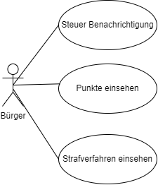

# Straßenverkehrsamt

**Autor:** Kevin Fischer

## Überblick

Der Microservice "Straßenverkehrsamt" aus dem Projekt "Smart-City 2022", soll einem im [HUB](https://smartcity-2022.github.io/Documentation/#/hub/index) registrierten Bürger die Möglichkeit geben, Angelegenheiten bzgl. Führerschein(-anträge), Fahrzeug Zulassungen und Ab- und Ummeldungen, Steuerangelegenheiten, Technische Überwachung, Punktesystem und sonstige Strafverfahren bzgl. des Straßenverkehrs zu erledigen.

## Funktionale Anforderungen

**Definition der Akteure**

| **Name** | **Beschreibung** |
| :------- | :------------ |
| Bürger | Ein im HUB registrierter Benutzer, der über normale Berechtigungen verfügt, um die o.g. Funktionen auszuführen |
| Sachbearbeiter | Ein Bearbeiter, der die Anträge eines Bürgers einsehen und administrieren kann |

**Use-Case Diagramme**

Zulassungsstelle

Führerscheinstelle

Technische Überwachung

Steuerstelle, Strafverfahren, Punktesystem

## Anforderungen im Detail

**User Stories**

| **Name**| **In meiner Rolle als**...|   ...**möchte ich**...   | ..., **so dass**... | **Erfüllt, wenn**... | **Priorität**   |
|:-----|:----------:|:-------------------|:-------------|:---------|:----------------|
| Authentifizierung  |Benutzer| meine Identität bestätigt bekommen|ich Handlungen unter meinen Namen tätigen kann| meine Daten angezeigt werden | Muss |
| Übersicht | Benutzer | eine Übersicht über alle Funktionen bekommen | ich schnell zu jeder Funktion gelangen kann | ich die Home-Page erreiche | Muss |
| Auto anmelden | Benutzer  | neue Autos anmelden können  | diese offiziell zugelassen sind | ein Antrag auf Zulassung gestellt wurde | Muss  |
| Auto abmelden | Benutzer  | bereits registriertes Auto abmelden | dieses nicht mehr in meinen Daten erscheint | Auto aus Datenbank gelöscht | Muss  |
| Auto ummelden | Benutzer  | bereits registriertes Kennzeichen auf anderes Auto umschreiben  | das gleiche Kennzeichen auf anderes Auto gemeldet ist | Anfrage auf Ummeldung erstellt wurde  | Muss  |
| Autos anzeigen  | Benutzer  | Autos die auf meinen Namen registriert sind anzeigen  | ich dieses mit ihren Details sehen kann | Autos in meinen Daten dargestellt werden | Muss |
| Führerschein Antrag | Benutzer | einen Führerschein Antrag stellen können | dieser ausgewertet werden kann | Eine Antwort bezüglich der Auswertung erhalten wird | Muss |
| Führerschein Infos | Benutzer | Informationen über bestandene Führerscheine erhalten | ich diese einsehen kann | meine Führerscheine mir angezeigt werden | Muss |
| TüV Status | Benutzer | Benachrichtigt werden, wenn ein TüV ansteht | ich rechtzeitig darauf reagieren kann | Nachricht angezeigt wird / gesendet wird | Muss |
| TüV Erneuern | Benutzer | TüV Zertifikate hochladen | der TüV "Timer" erneuert wird | das Ablaufdatum nach Verifizierung verändert wird | Muss |
| Steuer | Benutzer | Benachrichtigt werden, wenn eine Rechnung ansteht | ich rechtzeitig darauf reagieren kann | Nachricht angezeigt wird / gesendet wird | Muss |
| Punktesystem | Benutzer | meine gesammelten Punkte in Flensburg einsehen können | ich mein Fahrverhalten ggf. anpassen kann | Die Punkte angezeigt werden | Muss |
| Strafverfahren | Benutzer | getätigte Strafverfahren im Straßenverkehr abrufen können | ich diese mit dessen Details einsehen kann | diese Vergehen angezeigt werden | Muss |
| Anfragen bearbeiten | Sachbearbeiter  | Anfragen auf An- und Ummeldungen bearbeiten können  | diese genehmigt oder abgelehnt werden können  | Einträge in DB gelöscht / geändert / hinzugefügt werden | Optional  |

**Misuse Stories**

- Der Service ist NICHT dazu gedacht, sich allgemeine Informationen über Fahrzeuge zu beschaffen
- Der Service wird die Anträge (voraussichtlich) NICHT vollautomatisch bearbeiten, ein Sachbearbeiter ist immernoch von Nöten
- Der Service bietet keine direkte Konservation zwischen Bürger und Bearbeiter

## Graphische Benutzerschnittstelle

### Übersicht

### Auto anmelden

### Auto abmelden

### Auto ummelden

### Autos anzeigen

## Datenmodell 

**Entity Relationship Model**

## Abläufe

- Aktivitätsdiagramm für den Ablauf sämtlicher Use Cases
- Aktivitätsdiagramme für relevante Use Cases
- Aktivitätsdiagramm mit Swimlanes sind in der Regel hilfreich 
  für die Darstellung der Interaktion von Akteuren der Use Cases / User Stories
- Abläufe der Kommunikation von Rechnerknoten (z.B. Client/Server)
  in einem Sequenz- oder Aktivitätsdiagramm darstellen
- Modellieren Sie des weiteren die Diagramme, die für das (eigene) Verständnis des
  Softwaresystems hilfreich sind. 

## Schnittstellen

- Schnittstellenbeschreibung (API), z.B. mit OpenAPI 
- Auflistung der nach außen sichtbaren Schnittstelle des Microservices. Über welche Schnittstelle kann z.B. der Client den Server erreichen?
- In Event-gesteuerten Systemen ebenfalls die Definition der Ereignisse und deren Attribute
- Aufteilen in Commands, Events, Queries
* Abhängigkeiten: Liste mit Kommunikationsabhängigkeiten zu anderen Microservices

**Beispiel:**

### URL

http://smart.city/microservices/strassenverkehrsamt

### Events

**Tax event channel**

| **Name** | **Payload** | 
| :------ | :----- | 
| Tax not payed | int value |

### Dependencies

#### Event-Subscriptions

| **Service** | **Funktion** |
| :------ | :----- | 
| Citizen channel | CitizenUpdatedEvent |
| Citizen channel | CitizenDeletedEvent |

## Technische Umsetzung

### Softwarearchitektur

* Server
  * Web-Schicht: Python / Django
  * Logik-Schicht: Python
  * Persistenz-Schicht: MySQL Database

* Client
  * View-Schicht: HTML5, CSS3
  * Logik-Schicht: Javascript
  * Kommunikation-Schicht: Javascript, JSON

### Entwurf

- Detaillierte UML-Diagramme für relevante Softwarebausteine

### Fehlerbehandlung 

| **Fehler** | **Code** | **Beschreibung** |
| :------- | :------- | :------------ |
| Benutzertoken konnte nicht aufgelöst werden | 401 | Token konnte nicht zu einem Benutzer aufgelöst werden |
| Fehler beim auflösen des Tokens | 500 | Auflösen des Tokens wirft eine Exception |
| Token nicht vorhanden | 404 | Ressource nicht mit gesendet worden |
| Falscher Dateiformat für Fileuploads | 400 | Hochgeladene Datei für z.B. HU in einem ungültigen Format |
| Ungültiges Datum | 400 | Datum für Erstzulassung liegt z.B. in der Zukunft |
| Falsche Datentypen | 400 | Datentypen von Anfragen nicht dem Schema entsprechend |

### Validierung
  
  | **Name** | **Bereich** | **Beschreibung** |
  | :----- | :----- | :----- |
  | Anfragen erstellen | API | Jede Art von Anfrage kann überprüft werden, indem jeweils eine erstellt wird und getestet wird, ob diese auch anschließend existiert |
  | Datentypen | Datenmodell | Es sollte getestet werden, ob die angegebenen Datentypen auch wirklich funktionieren, indem man Datensätze hinzufügt, die die Attribute bis aufs Maximum füllen |

### Verwendete Technologien

- Frontend
  - HTML5, CSS3, Javascript / ReactJS
- Backend
  - Python / Django
- Datenbank
  - MySQL
